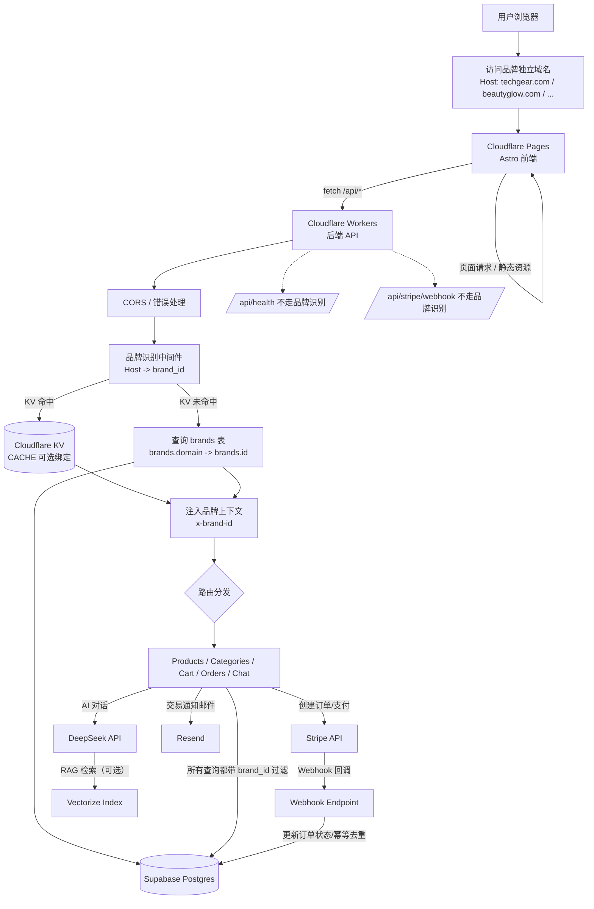

# DTC 内容电商系统

> 基于 Astro、Cloudflare Workers 和 Supabase 构建的现代 DTC（直接面向消费者）内容电商平台。

**注意**：项目中的 "DTC Store" 只是默认占位名称，可在 `.env` 文件中通过 `PUBLIC_SITE_NAME` 自定义。

## 🏗️ 多品牌架构

本系统采用**独立域名模式**的多租户架构，支持一套代码运营多个品牌：

```
┌─────────────────────────────────────────────────────────────┐
│                    Cloudflare Workers (API)                 │
│                    Cloudflare Pages (前端)                  │
├─────────────────────────────────────────────────────────────┤
│                                                             │
│   techgear.com ──────┐                                      │
│                      │      ┌──────────────────────┐        │
│   beautyglow.com ────┼─────▶│   Supabase 数据库    │        │
│                      │      │   (数据按 brand_id   │        │
│   fitnesspro.com ────┘      │    隔离)             │        │
│                             └──────────────────────┘        │
└─────────────────────────────────────────────────────────────┘
```

**工作原理：**
1. 每个品牌绑定独立域名（如 `techgear.com`、`beautyglow.com`）
2. 所有域名指向同一套 Cloudflare Workers/Pages
3. 系统根据访问域名自动识别品牌，查询对应数据
4. 客户看到的是完全独立的网站，互不知道其他品牌存在

**示例：**
| 品牌 | 域名 | 广告落地页示例 |
|------|------|----------------|
| TechGear | techgear.com | `https://techgear.com/products/wireless-earbuds` |
| BeautyGlow | beautyglow.com | `https://beautyglow.com/products/vitamin-c-serum` |

## 🧭 项目运作流程图（端到端）

> 如果你在 IDE 的 Markdown 预览里**看不到流程图渲染结果**，通常是因为预览器不支持 Mermaid。
> 建议：
> - 在 GitHub 页面查看 README（多数情况下会自动渲染 Mermaid）
> - 或安装/启用 Mermaid 预览插件（VS Code / JetBrains 系列常见）
> - 或复制 Mermaid 代码到 https://mermaid.live 进行预览

<details>
<summary>ASCII 备用流程图（无 Mermaid 也可显示）</summary>

```text
用户浏览器
  |
  | 访问品牌独立域名（Host: xxx.com）
  v
Cloudflare Pages（Astro 前端）
  |\
  | \ 静态资源 / 页面渲染
  |  \
  |   \ fetch /api/*
  v
Cloudflare Workers（后端 API）
  |
  | CORS / 错误处理
  v
品牌识别中间件：Host -> brand_id
  |\
  | \ KV 命中：CACHE.get(brand:domain:{host})
  |  \
  |   \ KV 未命中：查询 Supabase brands.domain -> brands.id
  v
注入品牌上下文（x-brand-id）
  |
  v
路由分发（products / categories / cart / orders / chat）
  |
  | 所有 DB 读写都带 brand_id 过滤
  v
Supabase Postgres

可选外部依赖：
  - Stripe：创建支付 -> Webhook 回调 -> 更新订单状态
  - DeepSeek + Vectorize：AI 对话 / RAG 检索
  - Resend：邮件通知

例外路径：
  - /api/health
  - /api/stripe/webhook
```

</details>



### 关键流程说明

- **域名即品牌（多租户核心）**
  - 浏览器请求携带 `Host` 头。
  - Worker 根据 `Host` 查询 `brands.domain` 得到当前 `brand_id`，从而实现“同一套代码，多品牌数据隔离”。

- **KV 缓存（可选）**
  - 若绑定了 `CACHE`（Cloudflare KV），品牌解析结果会以 `brand:domain:{host}` 缓存，减少 `brands` 表查询。
  - KV key **必须包含 Host**，避免跨域名缓存污染导致串品牌。

- **品牌上下文注入**
  - 解析到 `brand_id` 后，Worker 在内部把 `x-brand-id` 写入请求头，再交给各 API route 处理。
  - 各 route 使用 `x-brand-id` 对 Supabase 的所有查询/写入做 `brand_id` 过滤。

- **环境差异（安全性）**
  - **开发环境 localhost**：允许使用 `DEFAULT_BRAND_SLUG` 进行默认品牌回退，方便本地联调。
  - **生产环境**：域名未匹配时直接返回 404（避免误落到默认品牌造成“串站/串数据”）。

- **例外路径**
  - `/api/health`：健康检查。
  - `/api/stripe/webhook`：为了签名校验和回调处理稳定性，通常不走品牌识别链路（由 webhook 自身事件数据/映射来定位订单）。

## 🚀 技术栈

### 前端
- **Astro 5.x** - 静态站点生成，SEO 友好
- **TailwindCSS 4.x** - 现代原子化 CSS
- **TypeScript** - 类型安全

### 后端
- **Cloudflare Workers** - 边缘计算，全球分布
- **Supabase** - PostgreSQL 数据库 + 实时功能
- **DeepSeek AI** - AI 智能客服（RAG）

### 支付
- **Stripe** - 支付处理

### 邮件
- **Resend** - 交易邮件

## 📁 项目结构

```
├── frontend/              # Astro 前端应用
│   ├── src/
│   │   ├── pages/         # 页面路由
│   │   ├── components/    # 可复用组件
│   │   ├── layouts/       # 页面布局
│   │   ├── lib/           # 工具库
│   │   └── styles/        # 全局样式
│   └── public/            # 静态资源
│
├── worker/                # Cloudflare Worker 后端
│   └── src/
│       ├── routes/        # API 路由处理
│       └── utils/         # 共享工具
│
├── docs/                  # 文档
│   └── database/          # 数据库脚本
│
└── README.md
```

## 🛠️ 快速开始

### 环境要求
- Node.js 18+
- npm 或 pnpm
- Cloudflare 账号（用于 Workers）
- Supabase 账号
- Stripe 账号

### 安装步骤

1. **克隆仓库**
   ```bash
   git clone <repository-url>
   cd B2C_AI_System
   ```

2. **安装前端依赖**
   ```bash
   cd frontend
   npm install
   ```

3. **安装后端依赖**
   ```bash
   cd ../worker
   npm install
   ```

4. **配置环境变量**

   前端 (`.env`)：
   ```env
   PUBLIC_SUPABASE_URL=your-supabase-url
   PUBLIC_SUPABASE_ANON_KEY=your-anon-key
   PUBLIC_STRIPE_PUBLISHABLE_KEY=your-stripe-key
   PUBLIC_SITE_URL=https://your-domain.com
   PUBLIC_API_URL=https://api.your-domain.com
   ```

   后端（使用 `wrangler secret put`）：
   ```bash
   wrangler secret put SUPABASE_URL
   wrangler secret put SUPABASE_SERVICE_KEY
   wrangler secret put STRIPE_SECRET_KEY
   wrangler secret put STRIPE_WEBHOOK_SECRET
   wrangler secret put DEEPSEEK_API_KEY
   wrangler secret put RESEND_API_KEY
   ```

5. **初始化数据库**
   - 创建 Supabase 项目
   - 运行 `docs/database/` 目录下的 SQL 脚本

### 本地开发

**启动前端开发服务器：**
```bash
cd frontend
npm run dev
```

**启动后端开发服务器：**
```bash
cd worker
npm run dev
```

### 部署

详细部署指南请参考 [docs/DEPLOYMENT.md](docs/DEPLOYMENT.md)。

**快速部署：**

```bash
# 1. 配置 Worker secrets
cd worker
wrangler secret put SUPABASE_URL
wrangler secret put SUPABASE_SERVICE_KEY
wrangler secret put STRIPE_SECRET_KEY
wrangler secret put STRIPE_WEBHOOK_SECRET
wrangler secret put RESEND_API_KEY

# 2. 部署 Worker
npm run deploy

# 3. 部署前端到 Cloudflare Pages
cd ../frontend
npm run build
# 通过 GitHub 连接 Cloudflare Pages
```

**生产环境检查清单：**
- [ ] 所有 secrets 已配置
- [ ] 数据库迁移已执行
- [ ] Stripe Webhook 已配置
- [ ] 自定义域名已绑定
- [ ] SSL/HTTPS 已启用

## 📊 功能特性

### 第一阶段 - 基础电商 ✅
- [x] 产品目录（列表、详情、分类）
- [x] 购物车（添加、修改、删除）
- [x] Stripe 结算（PaymentIntent、Webhook）
- [x] 订单管理（状态流转、库存扣减）
- [x] 邮件通知（Resend）

### 第二阶段 - AI 能力 ✅
- [x] AI 智能客服（RAG + 流式响应）
- [x] 知识库管理（向量检索）
- [x] AI 内容生成（视频脚本、营销文案）

### 第三阶段 - 管理后台 ✅
- [x] 产品管理
- [x] 订单管理
- [x] 评价管理（审核、回复、购买者验证）
- [x] 作者管理（E-E-A-T）
- [x] 数据分析看板
- [x] 系统设置

### 第四阶段 - 已完成 ✅
- [x] Supabase Auth 登录认证
- [x] 多品牌管理（CRUD、域名配置）
- [x] 优惠券系统（创建、验证、结算集成）
- [x] 邮件模板管理
- [x] 邀请评价邮件

### 待开发
- [ ] 高级 SEO 工具
- [ ] RBAC 权限完善

## 🔄 完整功能流程图

```mermaid
flowchart TB
    subgraph 用户端
        U[用户浏览器] --> |访问| FE[前端页面]
        FE --> |浏览产品| PROD[产品列表/详情]
        FE --> |购物| CART[购物车]
        FE --> |结算| CHECKOUT[结算支付]
        FE --> |咨询| CHAT[AI 客服]
        FE --> |评价| REVIEW[产品评价]
    end

    subgraph 管理后台
        ADMIN[/admin] --> DASH[仪表盘]
        ADMIN --> ANALYTICS[数据分析]
        ADMIN --> PROD_MGR[产品管理]
        ADMIN --> ORDER_MGR[订单管理]
        ADMIN --> REVIEW_MGR[评价管理]
        ADMIN --> CONTENT[AI 内容生成]
        ADMIN --> AUTHORS[作者管理]
        ADMIN --> KB[知识库管理]
        ADMIN --> SETTINGS[系统设置]
    end

    subgraph API层
        API[Cloudflare Workers]
        API --> |brand_id 隔离| DB[(Supabase)]
    end

    subgraph AI服务
        DEEPSEEK[DeepSeek API]
        DEEPSEEK --> |RAG| VECTOR[向量检索]
        DEEPSEEK --> |生成| SCRIPT[视频脚本]
        DEEPSEEK --> |生成| COPY[营销文案]
    end

    subgraph 外部服务
        STRIPE[Stripe 支付]
        RESEND[Resend 邮件]
    end

    %% 连接
    PROD --> API
    CART --> API
    CHECKOUT --> API --> STRIPE
    CHAT --> API --> DEEPSEEK
    REVIEW --> API
    
    ANALYTICS --> API
    CONTENT --> API --> DEEPSEEK
    ORDER_MGR --> API --> RESEND
    REVIEW_MGR --> API
```

### 功能模块详解

```
┌─────────────────────────────────────────────────────────────────────────────┐
│                              DTC 内容电商系统                                │
├─────────────────────────────────────────────────────────────────────────────┤
│                                                                             │
│  ┌─────────────┐  ┌─────────────┐  ┌─────────────┐  ┌─────────────┐        │
│  │  产品模块   │  │  订单模块   │  │  AI 客服    │  │  内容生成   │        │
│  ├─────────────┤  ├─────────────┤  ├─────────────┤  ├─────────────┤        │
│  │ • 产品列表  │  │ • 购物车    │  │ • RAG 检索  │  │ • 视频脚本  │        │
│  │ • 产品详情  │  │ • 订单创建  │  │ • 流式响应  │  │ • 营销文案  │        │
│  │ • 分类管理  │  │ • 支付处理  │  │ • 知识库    │  │ • 多平台    │        │
│  │ • 库存管理  │  │ • 状态流转  │  │ • 多语言    │  │ • 多语气    │        │
│  └─────────────┘  └─────────────┘  └─────────────┘  └─────────────┘        │
│                                                                             │
│  ┌─────────────┐  ┌─────────────┐  ┌─────────────┐  ┌─────────────┐        │
│  │  评价系统   │  │  作者管理   │  │  数据分析   │  │  系统设置   │        │
│  ├─────────────┤  ├─────────────┤  ├─────────────┤  ├─────────────┤        │
│  │ • 评价列表  │  │ • 作者 CRUD │  │ • 销售概览  │  │ • 店铺信息  │        │
│  │ • 审核管理  │  │ • 资质证书  │  │ • 趋势图表  │  │ • AI 配置   │        │
│  │ • 商家回复  │  │ • 社交链接  │  │ • 产品排行  │  │ • 通知邮箱  │        │
│  │ • 购买验证  │  │ • E-E-A-T   │  │ • 转化漏斗  │  │ • 转人工词  │        │
│  └─────────────┘  └─────────────┘  └─────────────┘  └─────────────┘        │
│                                                                             │
└─────────────────────────────────────────────────────────────────────────────┘

数据流向：
                                                                              
  用户请求 ──► Cloudflare Workers ──► 品牌识别 ──► API 路由 ──► Supabase     
                     │                                │                       
                     │                                ├──► DeepSeek (AI)      
                     │                                ├──► Stripe (支付)      
                     │                                └──► Resend (邮件)      
                     │                                                        
                     └──► KV 缓存 (品牌信息)                                  
```

## 📝 API 接口

### 产品和订单
| 接口 | 方法 | 说明 |
|------|------|------|
| `/api/products/list` | POST | 获取产品列表（支持筛选） |
| `/api/products/:slug` | GET | 获取产品详情 |
| `/api/categories` | GET | 获取所有分类 |
| `/api/cart/validate` | POST | 验证购物车 |
| `/api/orders/create` | POST | 创建订单 |
| `/api/orders/:id` | GET | 获取订单详情 |
| `/api/stripe/webhook` | POST | Stripe Webhook |

### AI 功能
| 接口 | 方法 | 说明 |
|------|------|------|
| `/api/chat` | POST | AI 对话（单次响应） |
| `/api/chat/stream` | POST | AI 对话（流式响应） |
| `/api/knowledge` | GET/POST/PUT/DELETE | 知识库 CRUD |
| `/api/content/generate/script` | POST | 生成视频脚本 |
| `/api/content/generate/copy` | POST | 生成营销文案 |

### 管理功能
| 接口 | 方法 | 说明 |
|------|------|------|
| `/api/analytics/overview` | GET | 销售概览 |
| `/api/analytics/sales` | GET | 销售趋势 |
| `/api/analytics/products` | GET | 产品排行 |
| `/api/analytics/funnel` | GET | 转化漏斗 |
| `/api/authors` | GET/POST/PUT/DELETE | 作者管理 |
| `/api/reviews` | GET/POST/PUT/DELETE | 评价管理 |
| `/api/reviews/:id/reply` | POST | 商家回复评价 |
| `/api/settings` | GET/POST | 系统设置 |

## 📄 许可证

MIT

## 🤝 贡献

欢迎贡献！请先阅读贡献指南。
