# DTC 内容电商系统

> 基于 Astro、Cloudflare Workers 和 Supabase 构建的现代 DTC（直接面向消费者）内容电商平台。

**注意**：项目中的 "DTC Store" 只是默认占位名称，可在 `.env` 文件中通过 `PUBLIC_SITE_NAME` 自定义。

## 🏗️ 多品牌架构

本系统采用**独立域名模式**的多租户架构，支持一套代码运营多个品牌：

```
┌─────────────────────────────────────────────────────────────┐
│                    Cloudflare Workers (API)                 │
│                    Cloudflare Pages (前端)                  │
├─────────────────────────────────────────────────────────────┤
│                                                             │
│   techgear.com ──────┐                                      │
│                      │      ┌──────────────────────┐        │
│   beautyglow.com ────┼─────▶│   Supabase 数据库    │        │
│                      │      │   (数据按 brand_id   │        │
│   fitnesspro.com ────┘      │    隔离)             │        │
│                             └──────────────────────┘        │
└─────────────────────────────────────────────────────────────┘
```

**工作原理：**
1. 每个品牌绑定独立域名（如 `techgear.com`、`beautyglow.com`）
2. 所有域名指向同一套 Cloudflare Workers/Pages
3. 系统根据访问域名自动识别品牌，查询对应数据
4. 客户看到的是完全独立的网站，互不知道其他品牌存在

**示例：**
| 品牌 | 域名 | 广告落地页示例 |
|------|------|----------------|
| TechGear | techgear.com | `https://techgear.com/products/wireless-earbuds` |
| BeautyGlow | beautyglow.com | `https://beautyglow.com/products/vitamin-c-serum` |

## 🧭 项目运作流程图（端到端）

> 如果你在 IDE 的 Markdown 预览里**看不到流程图渲染结果**，通常是因为预览器不支持 Mermaid。
> 建议：
> - 在 GitHub 页面查看 README（多数情况下会自动渲染 Mermaid）
> - 或安装/启用 Mermaid 预览插件（VS Code / JetBrains 系列常见）
> - 或复制 Mermaid 代码到 https://mermaid.live 进行预览

<details>
<summary>ASCII 备用流程图（无 Mermaid 也可显示）</summary>

```text
用户浏览器
  |
  | 访问品牌独立域名（Host: xxx.com）
  v
Cloudflare Pages（Astro 前端）
  |\
  | \ 静态资源 / 页面渲染
  |  \
  |   \ fetch /api/*
  v
Cloudflare Workers（后端 API）
  |
  | CORS / 错误处理
  v
品牌识别中间件：Host -> brand_id
  |\
  | \ KV 命中：CACHE.get(brand:domain:{host})
  |  \
  |   \ KV 未命中：查询 Supabase brands.domain -> brands.id
  v
注入品牌上下文（x-brand-id）
  |
  v
路由分发（products / categories / cart / orders / chat）
  |
  | 所有 DB 读写都带 brand_id 过滤
  v
Supabase Postgres

可选外部依赖：
  - Stripe：创建支付 -> Webhook 回调 -> 更新订单状态
  - DeepSeek + Vectorize：AI 对话 / RAG 检索
  - Resend：邮件通知

例外路径：
  - /api/health
  - /api/stripe/webhook
```

</details>



```mermaid
flowchart TD
  U[用户浏览器] --> D[访问品牌独立域名<br/>Host: techgear.com / beautyglow.com / ...]

  %% Frontend
  D --> P[Cloudflare Pages<br/>Astro 前端]
  P -->|页面请求 / 静态资源| P
  P -->|fetch /api/*| W[Cloudflare Workers<br/>后端 API]

  %% Worker core
  W --> CORS[CORS / 错误处理]
  CORS --> BM[品牌识别中间件<br/>Host -> brand_id]

  %% Brand resolve + cache
  BM -->|KV 命中| KV[(Cloudflare KV<br/>CACHE 可选绑定)]
  BM -->|KV 未命中| BQ[查询 brands 表<br/>brands.domain -> brands.id]
  BQ --> DB[(Supabase Postgres)]
  KV --> INJ[注入品牌上下文<br/>x-brand-id]
  BQ --> INJ

  %% Routes
  INJ --> R{路由分发}
  R --> PR[Products / Categories / Cart / Orders / Chat]
  PR -->|所有查询都带 brand_id 过滤| DB

  %% Payments
  PR -->|创建订单/支付| S[Stripe API]
  S -->|Webhook 回调| WH[Webhook Endpoint]
  WH -->|更新订单状态/幂等去重| DB

  %% AI
  PR -->|AI 对话| AI[DeepSeek API]
  AI -->|RAG 检索（可选）| V[Vectorize Index]

  %% Email
  PR -->|交易通知邮件| E[Resend]

  %% Notes
  W -.-> H[/api/health 不走品牌识别/]
  W -.-> SW[/api/stripe/webhook 不走品牌识别/]
```

### 关键流程说明

- **域名即品牌（多租户核心）**
  - 浏览器请求携带 `Host` 头。
  - Worker 根据 `Host` 查询 `brands.domain` 得到当前 `brand_id`，从而实现“同一套代码，多品牌数据隔离”。

- **KV 缓存（可选）**
  - 若绑定了 `CACHE`（Cloudflare KV），品牌解析结果会以 `brand:domain:{host}` 缓存，减少 `brands` 表查询。
  - KV key **必须包含 Host**，避免跨域名缓存污染导致串品牌。

- **品牌上下文注入**
  - 解析到 `brand_id` 后，Worker 在内部把 `x-brand-id` 写入请求头，再交给各 API route 处理。
  - 各 route 使用 `x-brand-id` 对 Supabase 的所有查询/写入做 `brand_id` 过滤。

- **环境差异（安全性）**
  - **开发环境 localhost**：允许使用 `DEFAULT_BRAND_SLUG` 进行默认品牌回退，方便本地联调。
  - **生产环境**：域名未匹配时直接返回 404（避免误落到默认品牌造成“串站/串数据”）。

- **例外路径**
  - `/api/health`：健康检查。
  - `/api/stripe/webhook`：为了签名校验和回调处理稳定性，通常不走品牌识别链路（由 webhook 自身事件数据/映射来定位订单）。

## 🚀 技术栈

### 前端
- **Astro 5.x** - 静态站点生成，SEO 友好
- **TailwindCSS 4.x** - 现代原子化 CSS
- **TypeScript** - 类型安全

### 后端
- **Cloudflare Workers** - 边缘计算，全球分布
- **Supabase** - PostgreSQL 数据库 + 实时功能
- **DeepSeek AI** - AI 智能客服（RAG）

### 支付
- **Stripe** - 支付处理

### 邮件
- **Resend** - 交易邮件

## 📁 项目结构

```
├── frontend/              # Astro 前端应用
│   ├── src/
│   │   ├── pages/         # 页面路由
│   │   ├── components/    # 可复用组件
│   │   ├── layouts/       # 页面布局
│   │   ├── lib/           # 工具库
│   │   └── styles/        # 全局样式
│   └── public/            # 静态资源
│
├── worker/                # Cloudflare Worker 后端
│   └── src/
│       ├── routes/        # API 路由处理
│       └── utils/         # 共享工具
│
├── docs/                  # 文档
│   └── database/          # 数据库脚本
│
└── README.md
```

## 🛠️ 快速开始

### 环境要求
- Node.js 18+
- npm 或 pnpm
- Cloudflare 账号（用于 Workers）
- Supabase 账号
- Stripe 账号

### 安装步骤

1. **克隆仓库**
   ```bash
   git clone <repository-url>
   cd B2C_AI_System
   ```

2. **安装前端依赖**
   ```bash
   cd frontend
   npm install
   ```

3. **安装后端依赖**
   ```bash
   cd ../worker
   npm install
   ```

4. **配置环境变量**

   前端 (`.env`)：
   ```env
   PUBLIC_SUPABASE_URL=your-supabase-url
   PUBLIC_SUPABASE_ANON_KEY=your-anon-key
   PUBLIC_STRIPE_PUBLISHABLE_KEY=your-stripe-key
   PUBLIC_SITE_URL=https://your-domain.com
   PUBLIC_API_URL=https://api.your-domain.com
   ```

   后端（使用 `wrangler secret put`）：
   ```bash
   wrangler secret put SUPABASE_URL
   wrangler secret put SUPABASE_SERVICE_KEY
   wrangler secret put STRIPE_SECRET_KEY
   wrangler secret put STRIPE_WEBHOOK_SECRET
   wrangler secret put DEEPSEEK_API_KEY
   wrangler secret put RESEND_API_KEY
   ```

5. **初始化数据库**
   - 创建 Supabase 项目
   - 运行 `docs/database/` 目录下的 SQL 脚本

### 本地开发

**启动前端开发服务器：**
```bash
cd frontend
npm run dev
```

**启动后端开发服务器：**
```bash
cd worker
npm run dev
```

### 部署

**部署前端到 Cloudflare Pages：**
```bash
cd frontend
npm run build
# 通过 GitHub 连接 Cloudflare Pages 或使用 wrangler
```

**部署后端：**
```bash
cd worker
npm run deploy
```

## 📊 功能特性

### 第一阶段 - MVP
- [x] 产品目录
- [x] 购物车
- [ ] Stripe 结算
- [ ] 订单管理
- [ ] AI 智能客服（RAG）
- [ ] 管理后台

### 第二阶段 - 扩展
- [ ] 多品牌支持
- [ ] AI 内容生成
- [ ] 数据分析看板
- [ ] SEO 自动化

## 📝 API 接口

| 接口 | 方法 | 说明 |
|------|------|------|
| `/api/products/list` | POST | 获取产品列表（支持筛选） |
| `/api/products/:slug` | GET | 获取产品详情 |
| `/api/categories` | GET | 获取所有分类 |
| `/api/cart/validate` | POST | 验证购物车 |
| `/api/orders/create` | POST | 创建订单 |
| `/api/orders/:id` | GET | 获取订单详情 |
| `/api/stripe/webhook` | POST | Stripe Webhook（签名校验、更新订单状态） |
| `/api/chat` | POST | AI 对话（单次响应） |
| `/api/chat/stream` | POST | AI 对话（流式响应） |

## 📄 许可证

MIT

## 🤝 贡献

欢迎贡献！请先阅读贡献指南。
