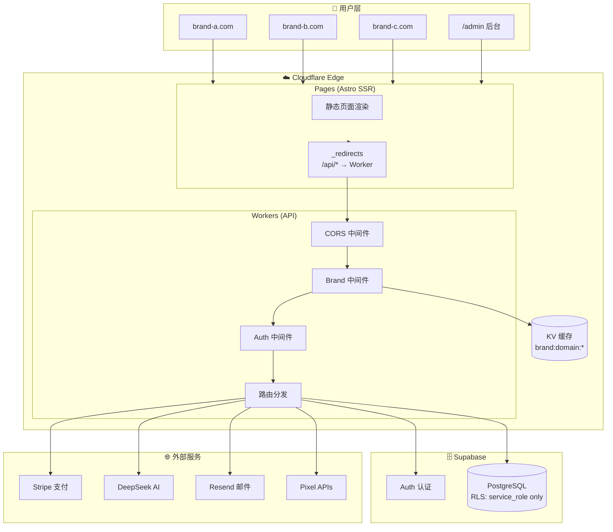

# 系统架构图

```mermaid
flowchart TB
    subgraph Users["👥 用户层"]
        U1["brand-a.com"]
        U2["brand-b.com"]
        U3["brand-c.com"]
        Admin["/admin 后台"]
    end

    subgraph CF["☁️ Cloudflare Edge"]
        subgraph Pages["Pages (Astro SSR)"]
            SSR["静态页面渲染"]
            Redirect["_redirects<br/>/api/* → Worker"]
        end
        
        subgraph Workers["Workers (API)"]
            MW1["CORS 中间件"]
            MW2["Brand 中间件"]
            MW3["Auth 中间件"]
            Router["路由分发"]
        end
        
        KV[("KV 缓存<br/>brand:domain:*")]
    end

    subgraph Supabase["🗄️ Supabase"]
        Auth["Auth 认证"]
        DB[("PostgreSQL<br/>RLS: service_role only")]
    end

    subgraph External["🌐 外部服务"]
        Stripe["Stripe 支付"]
        DeepSeek["DeepSeek AI"]
        Resend["Resend 邮件"]
        Pixels["Pixel APIs"]
    end

    U1 & U2 & U3 --> Pages
    Admin --> Pages
    Pages --> Redirect
    Redirect --> MW1
    MW1 --> MW2
    MW2 --> KV
    MW2 --> MW3
    MW3 --> Router
    Router --> DB
    Router --> Auth
    Router --> Stripe
    Router --> DeepSeek
    Router --> Resend
    Router --> Pixels
```
