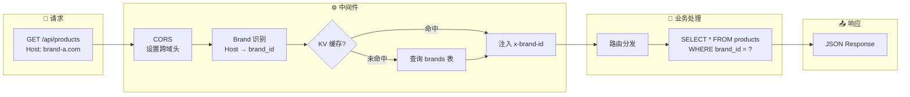

# 公共 API 流程图

```mermaid
flowchart LR
    subgraph Request["📨 请求"]
        R["GET /api/products<br/>Host: brand-a.com"]
    end

    subgraph Middleware["⚙️ 中间件"]
        CORS["CORS<br/>设置跨域头"]
        Brand["Brand 识别<br/>Host → brand_id"]
        Cache{"KV 缓存?"}
        DBLookup["查询 brands 表"]
        SetHeader["注入 x-brand-id"]
    end

    subgraph Business["💼 业务处理"]
        Route["路由分发"]
        Query["SELECT * FROM products<br/>WHERE brand_id = ?"]
    end

    subgraph Response["📤 响应"]
        JSON["JSON Response"]
    end

    R --> CORS --> Brand
    Brand --> Cache
    Cache -->|命中| SetHeader
    Cache -->|未命中| DBLookup --> SetHeader
    SetHeader --> Route --> Query --> JSON
```
