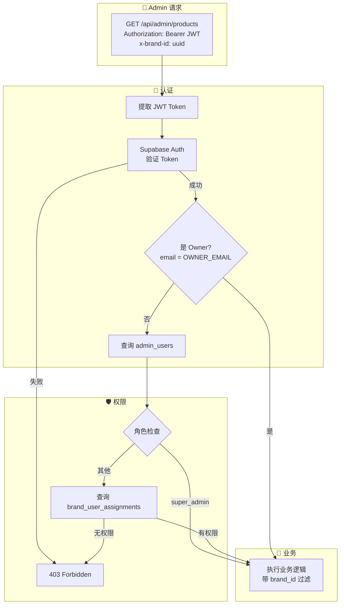

# 管理后台认证流程图

```mermaid
flowchart TB
    subgraph Request["📨 Admin 请求"]
        R["GET /api/admin/products<br/>Authorization: Bearer JWT<br/>x-brand-id: uuid"]
    end

    subgraph Auth["🔐 认证"]
        ExtractJWT["提取 JWT Token"]
        VerifyJWT["Supabase Auth<br/>验证 Token"]
        CheckOwner{"是 Owner?<br/>email = OWNER_EMAIL"}
        QueryAdmin["查询 admin_users"]
    end

    subgraph Permission["🛡️ 权限"]
        CheckRole{"角色检查"}
        QueryBrand["查询 brand_user_assignments"]
        Forbidden["403 Forbidden"]
    end

    subgraph Business["💼 业务"]
        Execute["执行业务逻辑<br/>带 brand_id 过滤"]
    end

    R --> ExtractJWT --> VerifyJWT
    VerifyJWT -->|失败| Forbidden
    VerifyJWT -->|成功| CheckOwner
    CheckOwner -->|是| Execute
    CheckOwner -->|否| QueryAdmin --> CheckRole
    CheckRole -->|super_admin| Execute
    CheckRole -->|其他| QueryBrand
    QueryBrand -->|有权限| Execute
    QueryBrand -->|无权限| Forbidden
```
