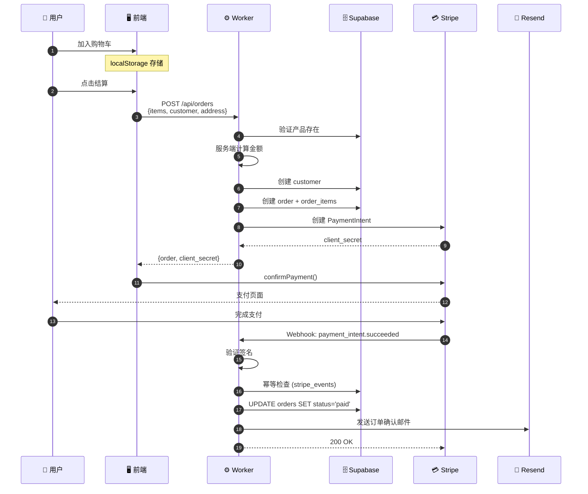

# 订单支付时序图

```mermaid
sequenceDiagram
    autonumber
    participant U as 👤 用户
    participant F as 🖥️ 前端
    participant W as ⚙️ Worker
    participant DB as 🗄️ Supabase
    participant S as 💳 Stripe
    participant E as 📧 Resend

    U->>F: 加入购物车
    Note over F: localStorage 存储

    U->>F: 点击结算
    F->>W: POST /api/orders<br/>{items, customer, address}
    
    W->>DB: 验证产品存在
    W->>W: 服务端计算金额
    W->>DB: 创建 customer
    W->>DB: 创建 order + order_items
    W->>S: 创建 PaymentIntent
    S-->>W: client_secret
    W-->>F: {order, client_secret}

    F->>S: confirmPayment()
    S-->>U: 支付页面

    U->>S: 完成支付
    S->>W: Webhook: payment_intent.succeeded
    
    W->>W: 验证签名
    W->>DB: 幂等检查 (stripe_events)
    W->>DB: UPDATE orders SET status='paid'
    W->>E: 发送订单确认邮件
    W-->>S: 200 OK
```
