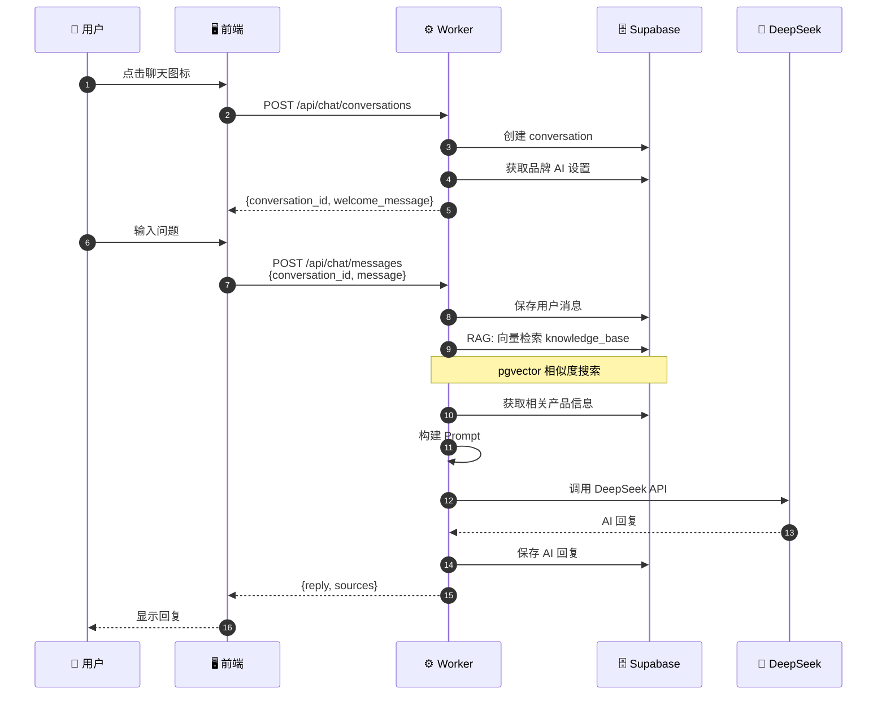

# AI 客服聊天时序图

```mermaid
sequenceDiagram
    autonumber
    participant U as 👤 用户
    participant F as 🖥️ 前端
    participant W as ⚙️ Worker
    participant DB as 🗄️ Supabase
    participant AI as 🤖 DeepSeek

    U->>F: 点击聊天图标
    F->>W: POST /api/chat/conversations
    W->>DB: 创建 conversation
    W->>DB: 获取品牌 AI 设置
    W-->>F: {conversation_id, welcome_message}

    U->>F: 输入问题
    F->>W: POST /api/chat/messages<br/>{conversation_id, message}
    
    W->>DB: 保存用户消息
    W->>DB: RAG: 向量检索 knowledge_base
    Note over W,DB: pgvector 相似度搜索
    
    W->>DB: 获取相关产品信息
    W->>W: 构建 Prompt
    W->>AI: 调用 DeepSeek API
    AI-->>W: AI 回复
    
    W->>DB: 保存 AI 回复
    W-->>F: {reply, sources}
    F-->>U: 显示回复
```
