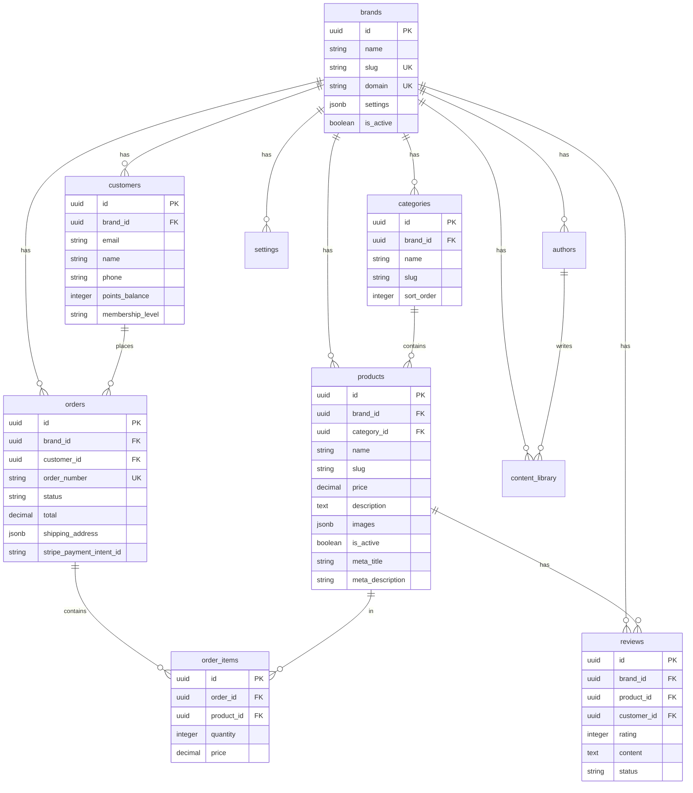
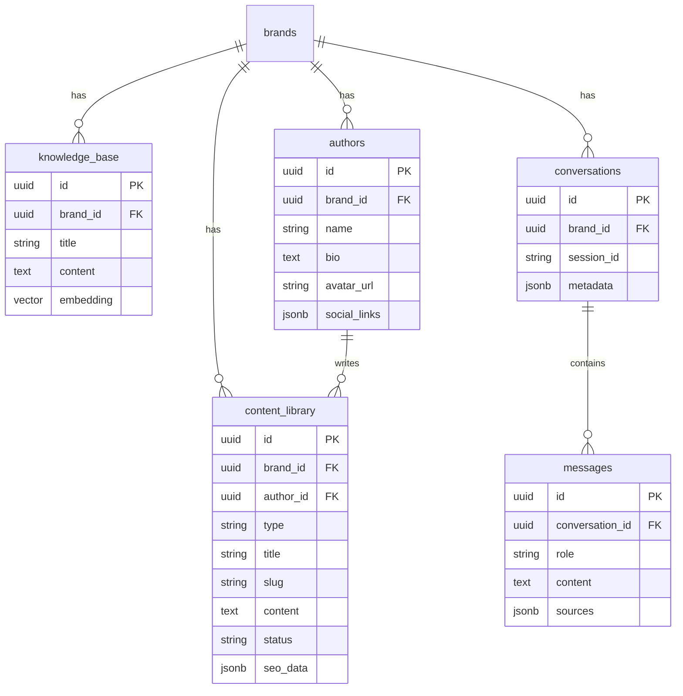
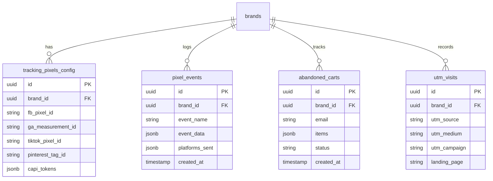
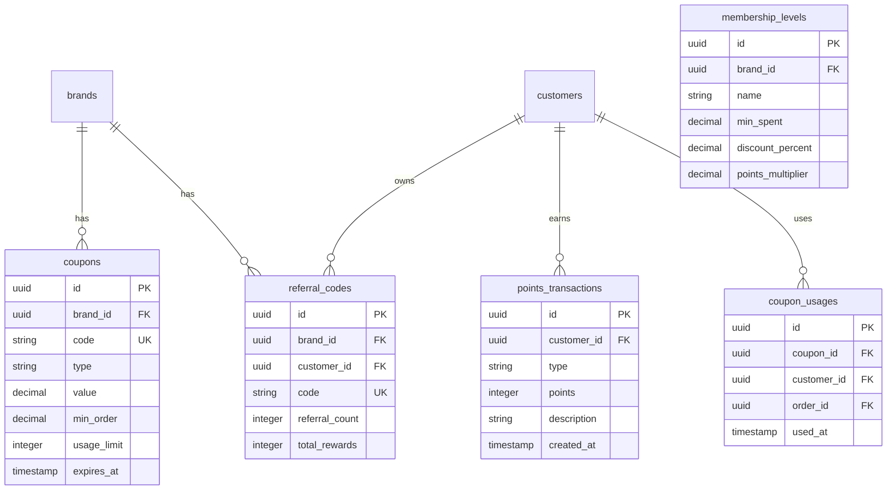
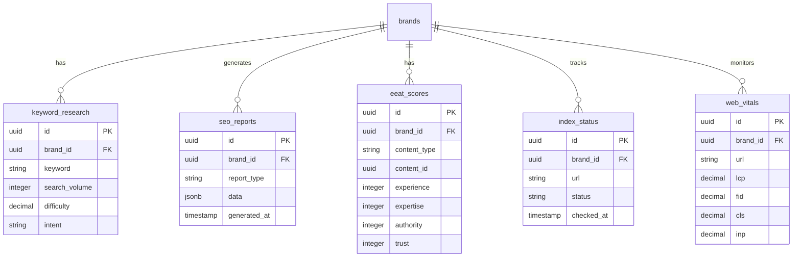
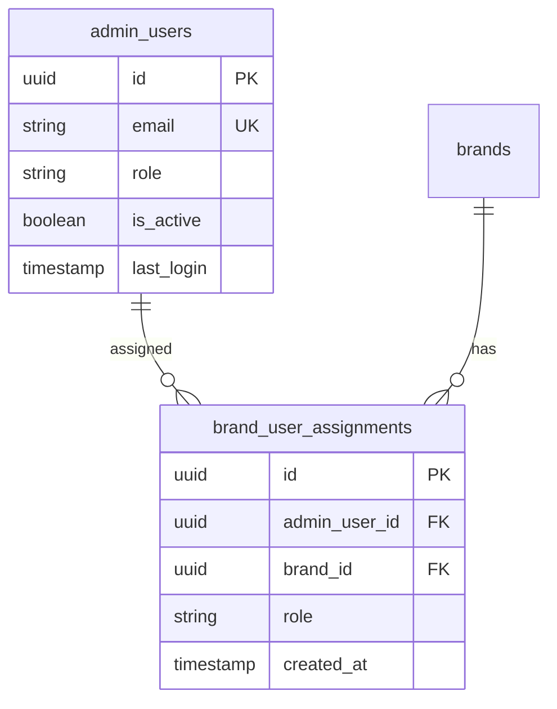

# 数据库 ER 图

## 6.1 核心业务表

```mermaid
erDiagram
    brands ||--o{ products : "has"
    brands ||--o{ categories : "has"
    brands ||--o{ orders : "has"
    brands ||--o{ customers : "has"
    brands ||--o{ settings : "has"
    brands ||--o{ reviews : "has"
    brands ||--o{ content_library : "has"
    brands ||--o{ authors : "has"
    
    categories ||--o{ products : "contains"
    customers ||--o{ orders : "places"
    orders ||--o{ order_items : "contains"
    products ||--o{ order_items : "in"
    products ||--o{ reviews : "has"
    authors ||--o{ content_library : "writes"
    
    brands {
        uuid id PK
        string name
        string slug UK
        string domain UK
        jsonb settings
        boolean is_active
    }
    
    products {
        uuid id PK
        uuid brand_id FK
        uuid category_id FK
        string name
        string slug
        decimal price
        text description
        jsonb images
        boolean is_active
        string meta_title
        string meta_description
    }
    
    categories {
        uuid id PK
        uuid brand_id FK
        string name
        string slug
        integer sort_order
    }
    
    orders {
        uuid id PK
        uuid brand_id FK
        uuid customer_id FK
        string order_number UK
        string status
        decimal total
        jsonb shipping_address
        string stripe_payment_intent_id
    }
    
    customers {
        uuid id PK
        uuid brand_id FK
        string email
        string name
        string phone
        integer points_balance
        string membership_level
    }
    
    order_items {
        uuid id PK
        uuid order_id FK
        uuid product_id FK
        integer quantity
        decimal price
    }
    
    reviews {
        uuid id PK
        uuid brand_id FK
        uuid product_id FK
        uuid customer_id FK
        integer rating
        text content
        string status
    }
```

## 6.2 内容与 AI 表

```mermaid
erDiagram
    brands ||--o{ content_library : "has"
    brands ||--o{ knowledge_base : "has"
    brands ||--o{ conversations : "has"
    brands ||--o{ authors : "has"
    
    conversations ||--o{ messages : "contains"
    authors ||--o{ content_library : "writes"
    
    content_library {
        uuid id PK
        uuid brand_id FK
        uuid author_id FK
        string type
        string title
        string slug
        text content
        string status
        jsonb seo_data
    }
    
    authors {
        uuid id PK
        uuid brand_id FK
        string name
        text bio
        string avatar_url
        jsonb social_links
    }
    
    knowledge_base {
        uuid id PK
        uuid brand_id FK
        string title
        text content
        vector embedding
    }
    
    conversations {
        uuid id PK
        uuid brand_id FK
        string session_id
        jsonb metadata
    }
    
    messages {
        uuid id PK
        uuid conversation_id FK
        string role
        text content
        jsonb sources
    }
```

## 6.3 营销追踪表

```mermaid
erDiagram
    brands ||--o{ tracking_pixels_config : "has"
    brands ||--o{ pixel_events : "logs"
    brands ||--o{ abandoned_carts : "tracks"
    brands ||--o{ utm_visits : "records"
    
    tracking_pixels_config {
        uuid id PK
        uuid brand_id FK
        string fb_pixel_id
        string ga_measurement_id
        string tiktok_pixel_id
        string pinterest_tag_id
        jsonb capi_tokens
    }
    
    pixel_events {
        uuid id PK
        uuid brand_id FK
        string event_name
        jsonb event_data
        jsonb platforms_sent
        timestamp created_at
    }
    
    abandoned_carts {
        uuid id PK
        uuid brand_id FK
        string email
        jsonb items
        string status
        timestamp created_at
    }
    
    utm_visits {
        uuid id PK
        uuid brand_id FK
        string utm_source
        string utm_medium
        string utm_campaign
        string landing_page
    }
```

## 6.4 用户留存表

```mermaid
erDiagram
    brands ||--o{ coupons : "has"
    brands ||--o{ referral_codes : "has"
    customers ||--o{ points_transactions : "earns"
    customers ||--o{ coupon_usages : "uses"
    customers ||--o{ referral_codes : "owns"
    
    coupons {
        uuid id PK
        uuid brand_id FK
        string code UK
        string type
        decimal value
        decimal min_order
        integer usage_limit
        timestamp expires_at
    }
    
    coupon_usages {
        uuid id PK
        uuid coupon_id FK
        uuid customer_id FK
        uuid order_id FK
        timestamp used_at
    }
    
    points_transactions {
        uuid id PK
        uuid customer_id FK
        string type
        integer points
        string description
        timestamp created_at
    }
    
    referral_codes {
        uuid id PK
        uuid brand_id FK
        uuid customer_id FK
        string code UK
        integer referral_count
        integer total_rewards
    }
    
    membership_levels {
        uuid id PK
        uuid brand_id FK
        string name
        decimal min_spent
        decimal discount_percent
        decimal points_multiplier
    }
```

## 6.5 SEO 工具表

```mermaid
erDiagram
    brands ||--o{ keyword_research : "has"
    brands ||--o{ seo_reports : "generates"
    brands ||--o{ eeat_scores : "has"
    brands ||--o{ index_status : "tracks"
    brands ||--o{ web_vitals : "monitors"
    
    keyword_research {
        uuid id PK
        uuid brand_id FK
        string keyword
        integer search_volume
        decimal difficulty
        string intent
    }
    
    seo_reports {
        uuid id PK
        uuid brand_id FK
        string report_type
        jsonb data
        timestamp generated_at
    }
    
    eeat_scores {
        uuid id PK
        uuid brand_id FK
        string content_type
        uuid content_id
        integer experience
        integer expertise
        integer authority
        integer trust
    }
    
    index_status {
        uuid id PK
        uuid brand_id FK
        string url
        string status
        timestamp checked_at
    }
    
    web_vitals {
        uuid id PK
        uuid brand_id FK
        string url
        decimal lcp
        decimal fid
        decimal cls
        decimal inp
    }
```

## 6.6 管理员与权限表

```mermaid
erDiagram
    admin_users ||--o{ brand_user_assignments : "assigned"
    brands ||--o{ brand_user_assignments : "has"
    
    admin_users {
        uuid id PK
        string email UK
        string role
        boolean is_active
        timestamp last_login
    }
    
    brand_user_assignments {
        uuid id PK
        uuid admin_user_id FK
        uuid brand_id FK
        string role
        timestamp created_at
    }
```
