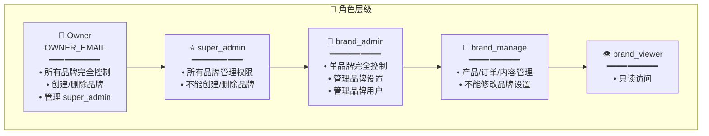

# 权限层级图

```mermaid
flowchart TB
    subgraph Roles["👥 角色层级"]
        Owner["🔑 Owner<br/>OWNER_EMAIL<br/>━━━━━━━━━━<br/>• 所有品牌完全控制<br/>• 创建/删除品牌<br/>• 管理 super_admin"]
        
        SuperAdmin["⭐ super_admin<br/>━━━━━━━━━━<br/>• 所有品牌管理权限<br/>• 不能创建/删除品牌"]
        
        BrandAdmin["👔 brand_admin<br/>━━━━━━━━━━<br/>• 单品牌完全控制<br/>• 管理品牌设置<br/>• 管理品牌用户"]
        
        BrandManage["📝 brand_manage<br/>━━━━━━━━━━<br/>• 产品/订单/内容管理<br/>• 不能修改品牌设置"]
        
        BrandViewer["👁️ brand_viewer<br/>━━━━━━━━━━<br/>• 只读访问"]
    end

    Owner --> SuperAdmin --> BrandAdmin --> BrandManage --> BrandViewer
```
