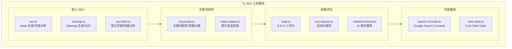
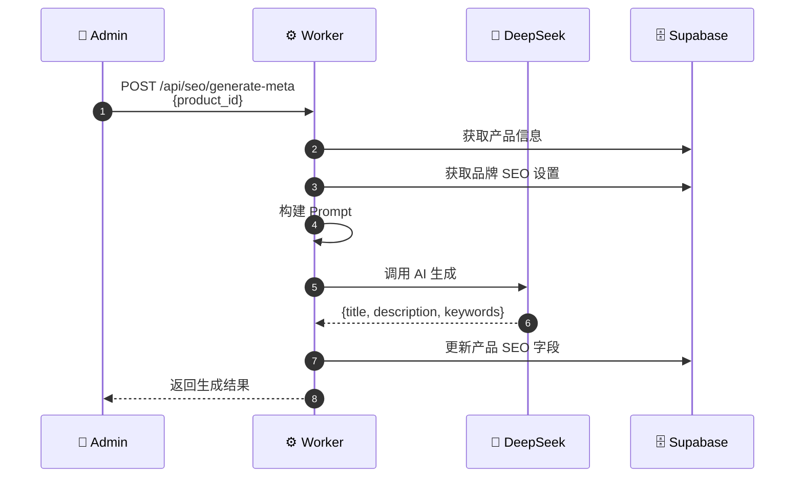
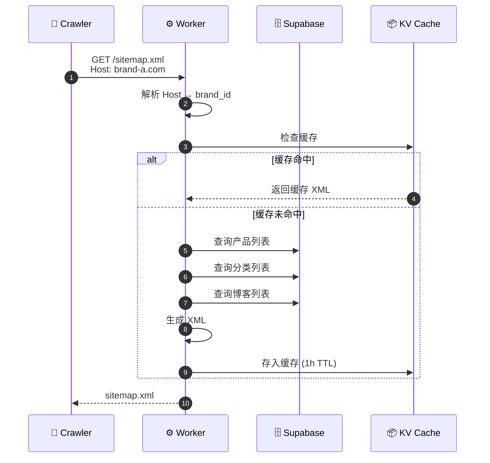
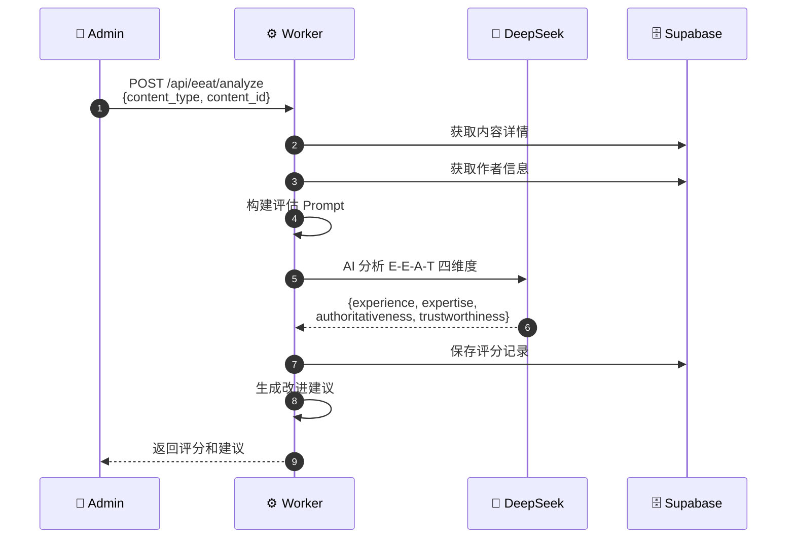
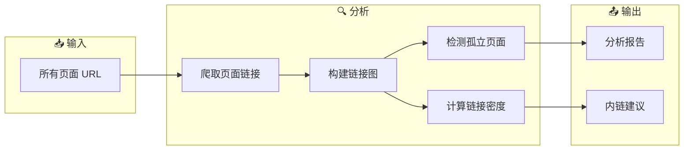
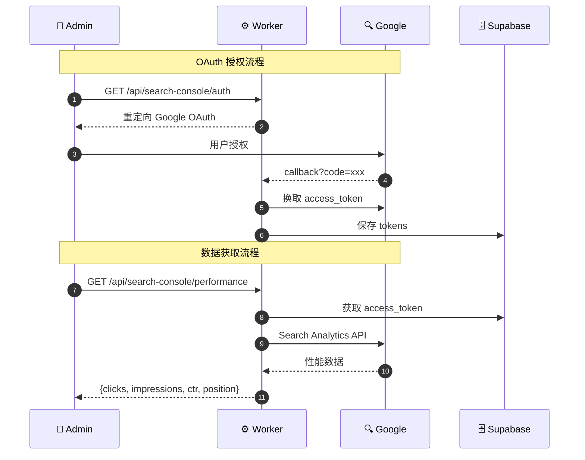

# SEO 工具流程图

## 8.1 SEO 工具总览

```mermaid
flowchart TB
    subgraph SEO["🔍 SEO 工具模块"]
        subgraph Core["核心 SEO"]
            seo["seo.ts<br/>Meta 生成/内容分析"]
            sitemap["sitemap.ts<br/>Sitemap 生成/分片"]
            seoLinks["seo-links.ts<br/>孤立页面/内链分析"]
        end
        
        subgraph Research["关键词研究"]
            keywords["keywords.ts<br/>关键词研究/意图分类"]
            indexStatus["index-status.ts<br/>索引状态检查"]
        end
        
        subgraph Quality["质量评估"]
            eeat["eeat.ts<br/>E-E-A-T 评分"]
            seoReports["seo-reports.ts<br/>自动化报告"]
            relatedContent["related-content.ts<br/>AI 相关推荐"]
        end
        
        subgraph External["外部集成"]
            searchConsole["search-console.ts<br/>Google Search Console"]
            webVitals["web-vitals.ts<br/>Core Web Vitals"]
        end
    end

    Core --> Research
    Research --> Quality
    Quality --> External
```

## 8.2 SEO Meta 生成流程

```mermaid
sequenceDiagram
    autonumber
    participant A as 👤 Admin
    participant W as ⚙️ Worker
    participant AI as 🤖 DeepSeek
    participant DB as 🗄️ Supabase

    A->>W: POST /api/seo/generate-meta<br/>{product_id}
    W->>DB: 获取产品信息
    W->>DB: 获取品牌 SEO 设置
    W->>W: 构建 Prompt
    W->>AI: 调用 AI 生成
    AI-->>W: {title, description, keywords}
    W->>DB: 更新产品 SEO 字段
    W-->>A: 返回生成结果
```

## 8.3 Sitemap 生成流程

```mermaid
sequenceDiagram
    autonumber
    participant C as 🤖 Crawler
    participant W as ⚙️ Worker
    participant DB as 🗄️ Supabase
    participant KV as 📦 KV Cache

    C->>W: GET /sitemap.xml<br/>Host: brand-a.com
    W->>W: 解析 Host → brand_id
    W->>KV: 检查缓存
    
    alt 缓存命中
        KV-->>W: 返回缓存 XML
    else 缓存未命中
        W->>DB: 查询产品列表
        W->>DB: 查询分类列表
        W->>DB: 查询博客列表
        W->>W: 生成 XML
        W->>KV: 存入缓存 (1h TTL)
    end
    
    W-->>C: sitemap.xml
```

## 8.4 E-E-A-T 评分流程

```mermaid
sequenceDiagram
    autonumber
    participant A as 👤 Admin
    participant W as ⚙️ Worker
    participant AI as 🤖 DeepSeek
    participant DB as 🗄️ Supabase

    A->>W: POST /api/eeat/analyze<br/>{content_type, content_id}
    W->>DB: 获取内容详情
    W->>DB: 获取作者信息
    W->>W: 构建评估 Prompt
    W->>AI: AI 分析 E-E-A-T 四维度
    AI-->>W: {experience, expertise,<br/>authoritativeness, trustworthiness}
    W->>DB: 保存评分记录
    W->>W: 生成改进建议
    W-->>A: 返回评分和建议
```

## 8.5 内链分析流程

```mermaid
flowchart LR
    subgraph Input["📥 输入"]
        Pages["所有页面 URL"]
    end
    
    subgraph Analysis["🔍 分析"]
        Crawl["爬取页面链接"]
        Graph["构建链接图"]
        Orphan["检测孤立页面"]
        Density["计算链接密度"]
    end
    
    subgraph Output["📤 输出"]
        Report["分析报告"]
        Suggestions["内链建议"]
    end
    
    Pages --> Crawl --> Graph
    Graph --> Orphan --> Report
    Graph --> Density --> Suggestions
```

## 8.6 Google Search Console 集成

```mermaid
sequenceDiagram
    autonumber
    participant A as 👤 Admin
    participant W as ⚙️ Worker
    participant G as 🔍 Google
    participant DB as 🗄️ Supabase

    Note over A,G: OAuth 授权流程
    A->>W: GET /api/search-console/auth
    W-->>A: 重定向 Google OAuth
    A->>G: 用户授权
    G-->>W: callback?code=xxx
    W->>G: 换取 access_token
    W->>DB: 保存 tokens
    
    Note over A,G: 数据获取流程
    A->>W: GET /api/search-console/performance
    W->>DB: 获取 access_token
    W->>G: Search Analytics API
    G-->>W: 性能数据
    W-->>A: {clicks, impressions, ctr, position}
```
