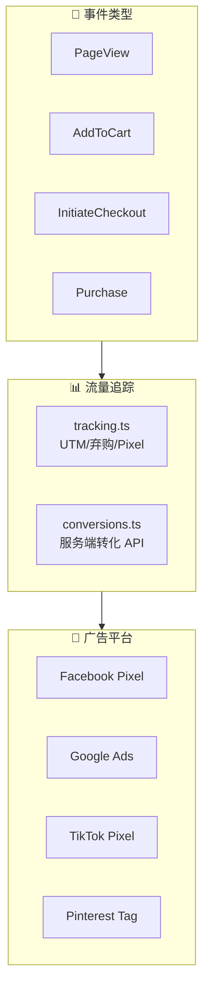
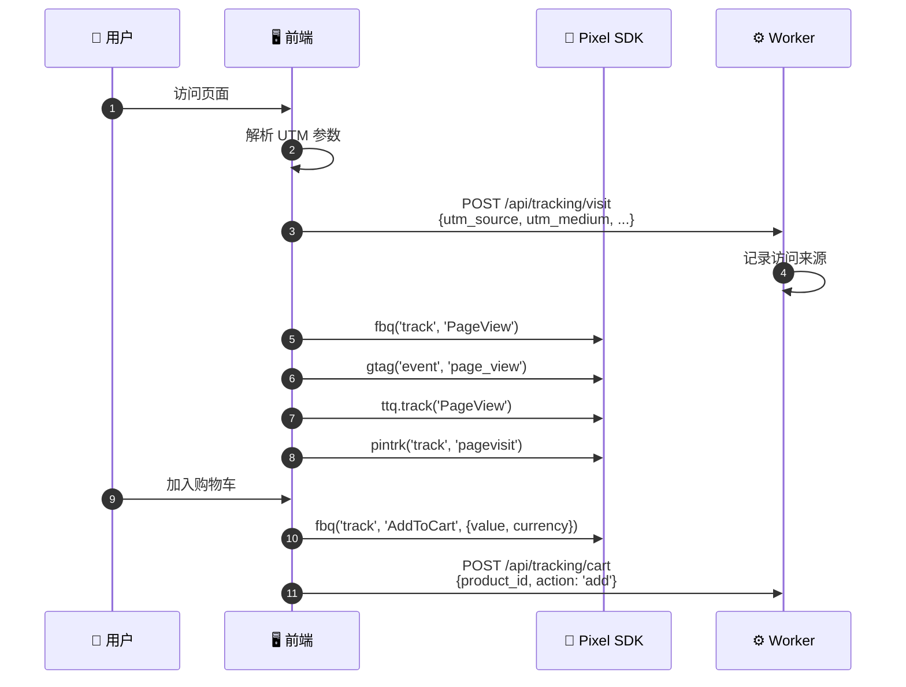
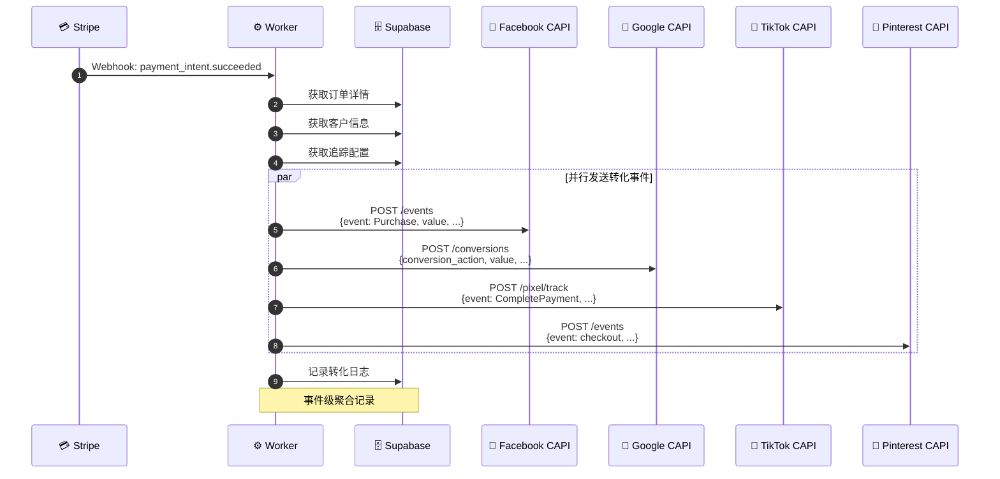
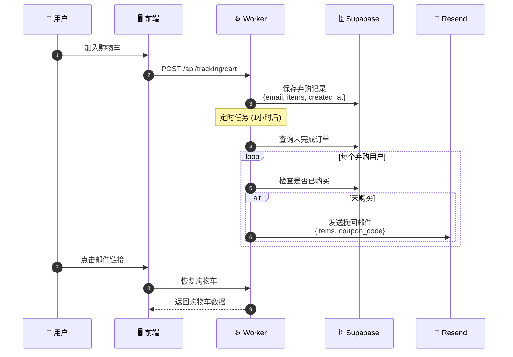
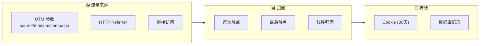
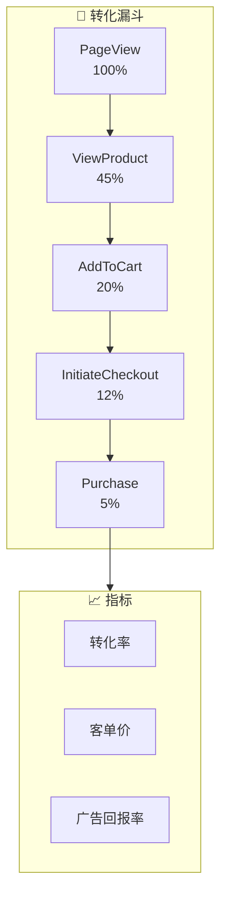

# 营销追踪流程图

## 9.1 追踪模块总览

```mermaid
flowchart TB
    subgraph Tracking["📊 流量追踪"]
        tracking["tracking.ts<br/>UTM/弃购/Pixel"]
        conversions["conversions.ts<br/>服务端转化 API"]
    end
    
    subgraph Pixels["🎯 广告平台"]
        FB["Facebook Pixel"]
        GA["Google Ads"]
        TT["TikTok Pixel"]
        PT["Pinterest Tag"]
    end
    
    subgraph Events["📌 事件类型"]
        PV["PageView"]
        ATC["AddToCart"]
        IC["InitiateCheckout"]
        PUR["Purchase"]
    end
    
    Events --> Tracking
    Tracking --> Pixels
```

## 9.2 前端 Pixel 追踪流程

```mermaid
sequenceDiagram
    autonumber
    participant U as 👤 用户
    participant F as 🖥️ 前端
    participant P as 🎯 Pixel SDK
    participant W as ⚙️ Worker

    U->>F: 访问页面
    F->>F: 解析 UTM 参数
    F->>W: POST /api/tracking/visit<br/>{utm_source, utm_medium, ...}
    W->>W: 记录访问来源
    
    F->>P: fbq('track', 'PageView')
    F->>P: gtag('event', 'page_view')
    F->>P: ttq.track('PageView')
    F->>P: pintrk('track', 'pagevisit')
    
    U->>F: 加入购物车
    F->>P: fbq('track', 'AddToCart', {value, currency})
    F->>W: POST /api/tracking/cart<br/>{product_id, action: 'add'}
```

## 9.3 服务端转化 API (Conversions API)

```mermaid
sequenceDiagram
    autonumber
    participant S as 💳 Stripe
    participant W as ⚙️ Worker
    participant DB as 🗄️ Supabase
    participant FB as 📘 Facebook CAPI
    participant GA as 🔵 Google CAPI
    participant TT as 🎵 TikTok CAPI
    participant PT as 📌 Pinterest CAPI

    S->>W: Webhook: payment_intent.succeeded
    W->>DB: 获取订单详情
    W->>DB: 获取客户信息
    W->>DB: 获取追踪配置
    
    par 并行发送转化事件
        W->>FB: POST /events<br/>{event: Purchase, value, ...}
        W->>GA: POST /conversions<br/>{conversion_action, value, ...}
        W->>TT: POST /pixel/track<br/>{event: CompletePayment, ...}
        W->>PT: POST /events<br/>{event: checkout, ...}
    end
    
    W->>DB: 记录转化日志
    Note over W,DB: 事件级聚合记录
```

## 9.4 弃购挽回流程

```mermaid
sequenceDiagram
    autonumber
    participant U as 👤 用户
    participant F as 🖥️ 前端
    participant W as ⚙️ Worker
    participant DB as 🗄️ Supabase
    participant E as 📧 Resend
    
    U->>F: 加入购物车
    F->>W: POST /api/tracking/cart
    W->>DB: 保存弃购记录<br/>{email, items, created_at}
    
    Note over W: 定时任务 (1小时后)
    W->>DB: 查询未完成订单
    
    loop 每个弃购用户
        W->>DB: 检查是否已购买
        alt 未购买
            W->>E: 发送挽回邮件<br/>{items, coupon_code}
        end
    end
    
    U->>F: 点击邮件链接
    F->>W: 恢复购物车
    W-->>F: 返回购物车数据
```

## 9.5 UTM 归因模型

```mermaid
flowchart LR
    subgraph Sources["📥 流量来源"]
        UTM["UTM 参数<br/>source/medium/campaign"]
        Referrer["HTTP Referrer"]
        Direct["直接访问"]
    end
    
    subgraph Attribution["📊 归因"]
        First["首次触点"]
        Last["最后触点"]
        Linear["线性归因"]
    end
    
    subgraph Storage["💾 存储"]
        Cookie["Cookie (30天)"]
        DB["数据库记录"]
    end
    
    Sources --> Attribution --> Storage
```

## 9.6 转化漏斗分析

```mermaid
flowchart TB
    subgraph Funnel["🔻 转化漏斗"]
        PV["PageView<br/>100%"]
        VP["ViewProduct<br/>45%"]
        ATC["AddToCart<br/>20%"]
        IC["InitiateCheckout<br/>12%"]
        PUR["Purchase<br/>5%"]
    end
    
    PV --> VP --> ATC --> IC --> PUR
    
    subgraph Metrics["📈 指标"]
        CVR["转化率"]
        AOV["客单价"]
        ROAS["广告回报率"]
    end
    
    PUR --> Metrics
```
