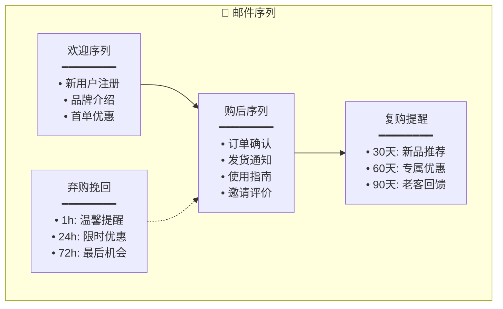
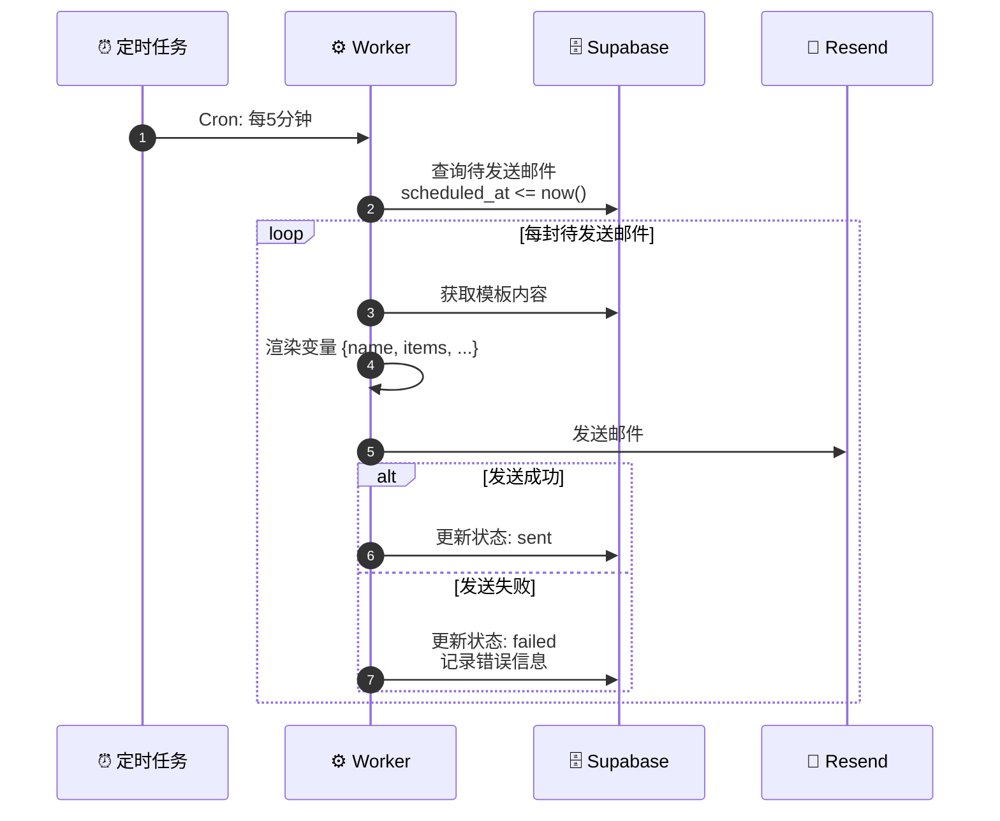
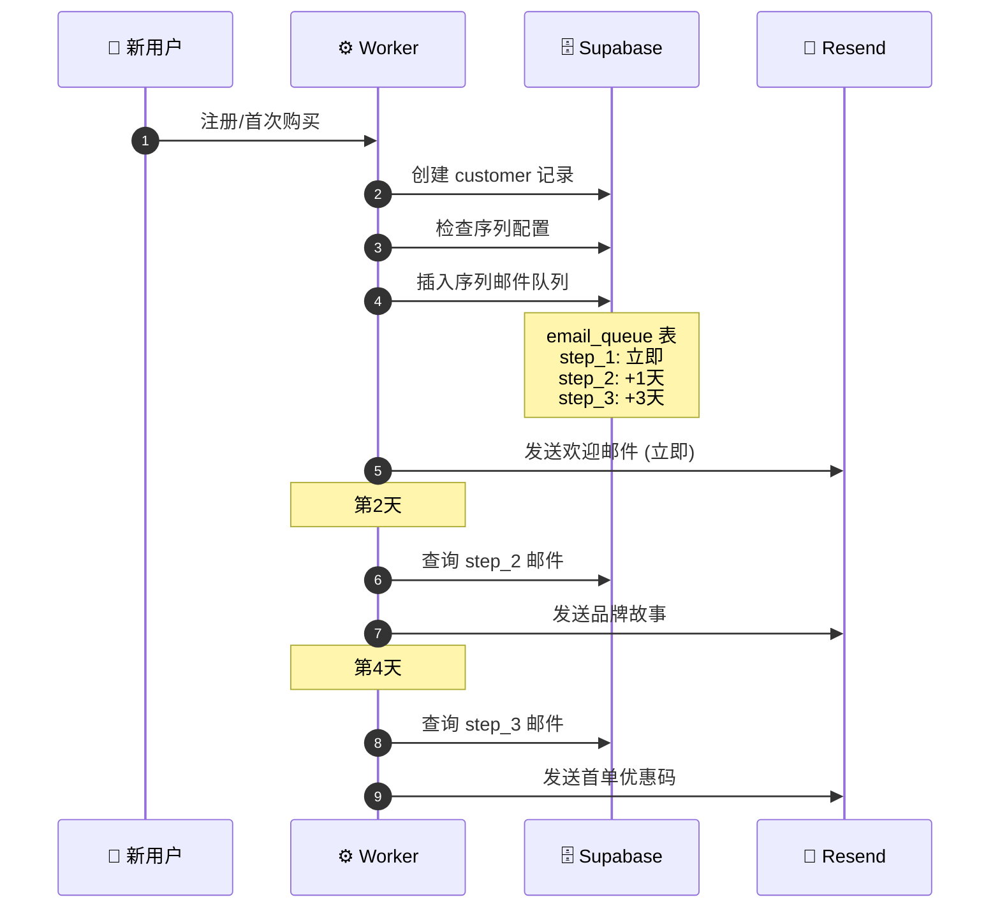
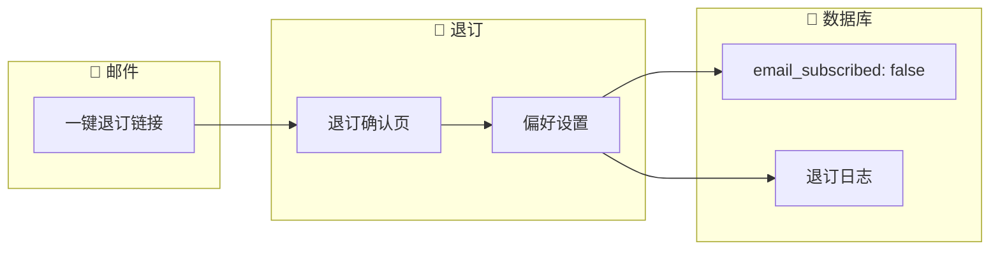
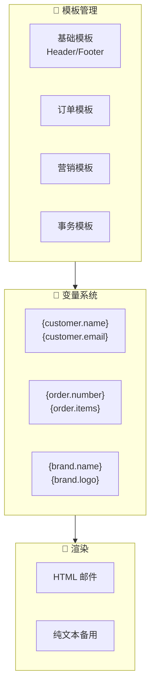

# 邮件序列流程图

## 10.1 邮件序列类型

```mermaid
flowchart TB
    subgraph Sequences["📧 邮件序列"]
        Welcome["欢迎序列<br/>━━━━━━━━<br/>• 新用户注册<br/>• 品牌介绍<br/>• 首单优惠"]
        
        Abandoned["弃购挽回<br/>━━━━━━━━<br/>• 1h: 温馨提醒<br/>• 24h: 限时优惠<br/>• 72h: 最后机会"]
        
        PostPurchase["购后序列<br/>━━━━━━━━<br/>• 订单确认<br/>• 发货通知<br/>• 使用指南<br/>• 邀请评价"]
        
        Winback["复购提醒<br/>━━━━━━━━<br/>• 30天: 新品推荐<br/>• 60天: 专属优惠<br/>• 90天: 老客回馈"]
    end
    
    Welcome --> PostPurchase --> Winback
    Abandoned -.-> PostPurchase
```

## 10.2 邮件发送流程

```mermaid
sequenceDiagram
    autonumber
    participant T as ⏰ 定时任务
    participant W as ⚙️ Worker
    participant DB as 🗄️ Supabase
    participant E as 📧 Resend

    T->>W: Cron: 每5分钟
    W->>DB: 查询待发送邮件<br/>scheduled_at <= now()
    
    loop 每封待发送邮件
        W->>DB: 获取模板内容
        W->>W: 渲染变量 {name, items, ...}
        W->>E: 发送邮件
        
        alt 发送成功
            W->>DB: 更新状态: sent
        else 发送失败
            W->>DB: 更新状态: failed<br/>记录错误信息
        end
    end
```

## 10.3 欢迎序列详细流程

```mermaid
sequenceDiagram
    autonumber
    participant U as 👤 新用户
    participant W as ⚙️ Worker
    participant DB as 🗄️ Supabase
    participant E as 📧 Resend

    U->>W: 注册/首次购买
    W->>DB: 创建 customer 记录
    W->>DB: 检查序列配置
    
    W->>DB: 插入序列邮件队列
    Note over DB: email_queue 表<br/>step_1: 立即<br/>step_2: +1天<br/>step_3: +3天
    
    W->>E: 发送欢迎邮件 (立即)
    
    Note over W: 第2天
    W->>DB: 查询 step_2 邮件
    W->>E: 发送品牌故事
    
    Note over W: 第4天
    W->>DB: 查询 step_3 邮件
    W->>E: 发送首单优惠码
```

## 10.4 退订管理

```mermaid
flowchart LR
    subgraph Email["📧 邮件"]
        Link["一键退订链接"]
    end
    
    subgraph Unsubscribe["🚫 退订"]
        Page["退订确认页"]
        Preferences["偏好设置"]
    end
    
    subgraph Database["💾 数据库"]
        Status["email_subscribed: false"]
        Log["退订日志"]
    end
    
    Link --> Page --> Preferences
    Preferences --> Status
    Preferences --> Log
```

## 10.5 邮件模板系统

```mermaid
flowchart TB
    subgraph Templates["📝 模板管理"]
        Base["基础模板<br/>Header/Footer"]
        Order["订单模板"]
        Marketing["营销模板"]
        Transactional["事务模板"]
    end
    
    subgraph Variables["🔧 变量系统"]
        Customer["{customer.name}<br/>{customer.email}"]
        Order2["{order.number}<br/>{order.items}"]
        Brand["{brand.name}<br/>{brand.logo}"]
    end
    
    subgraph Render["🎨 渲染"]
        HTML["HTML 邮件"]
        Text["纯文本备用"]
    end
    
    Templates --> Variables --> Render
```
