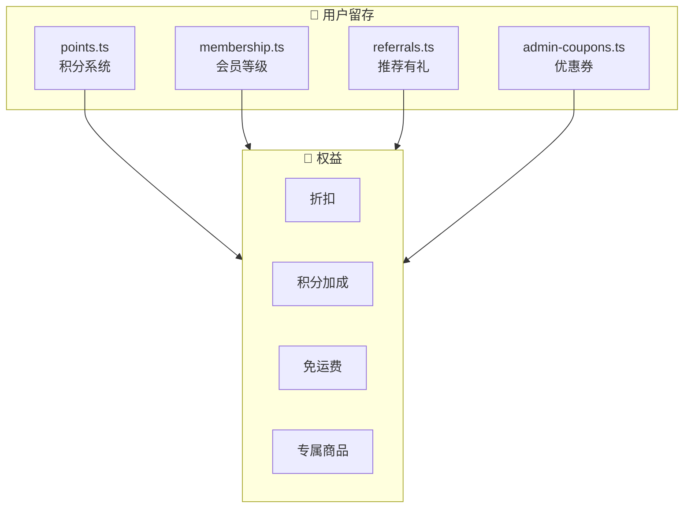
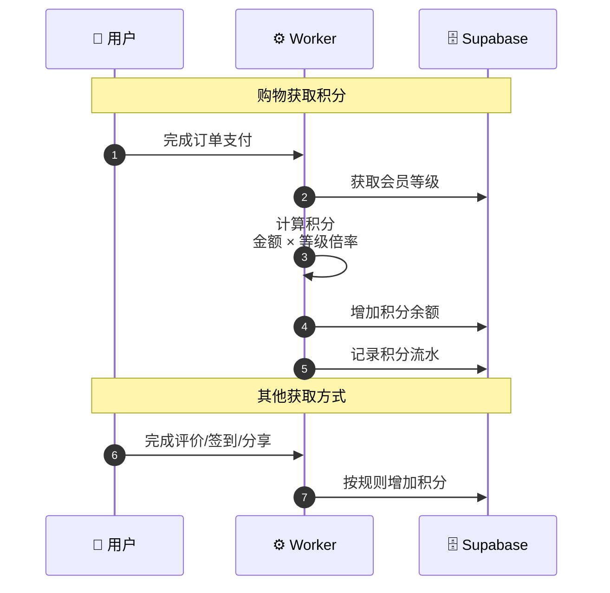
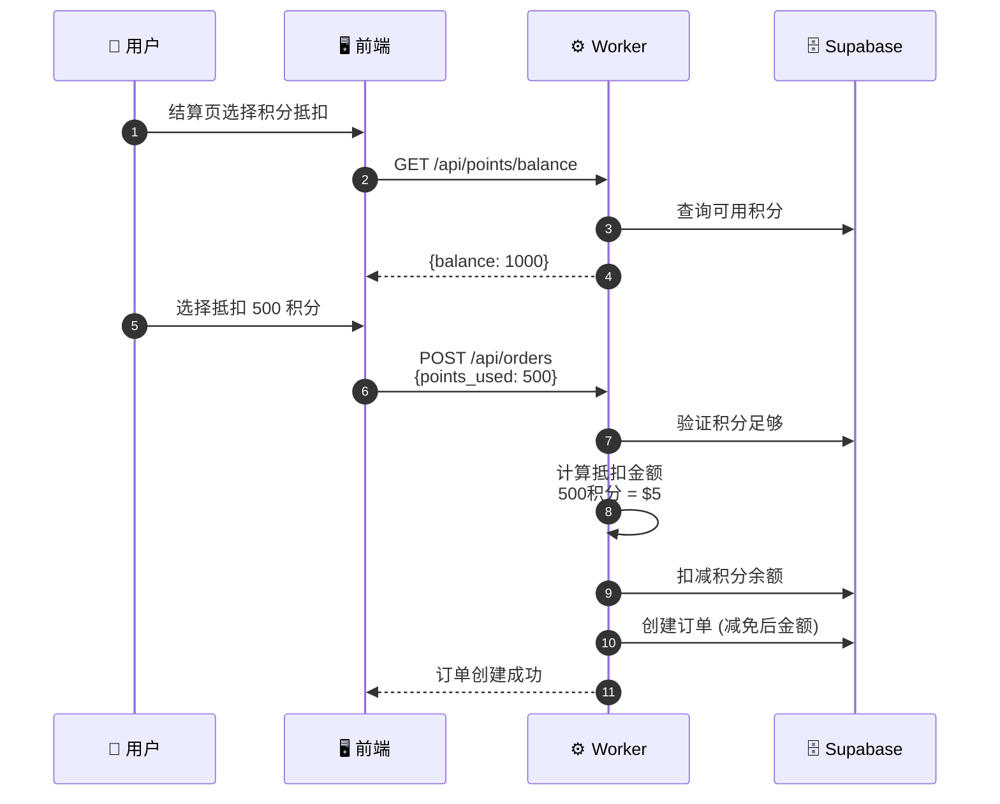
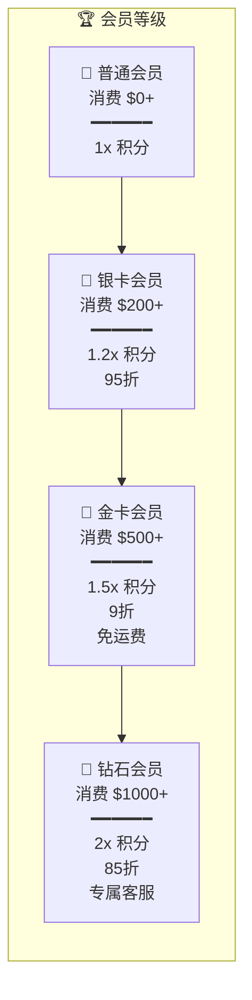
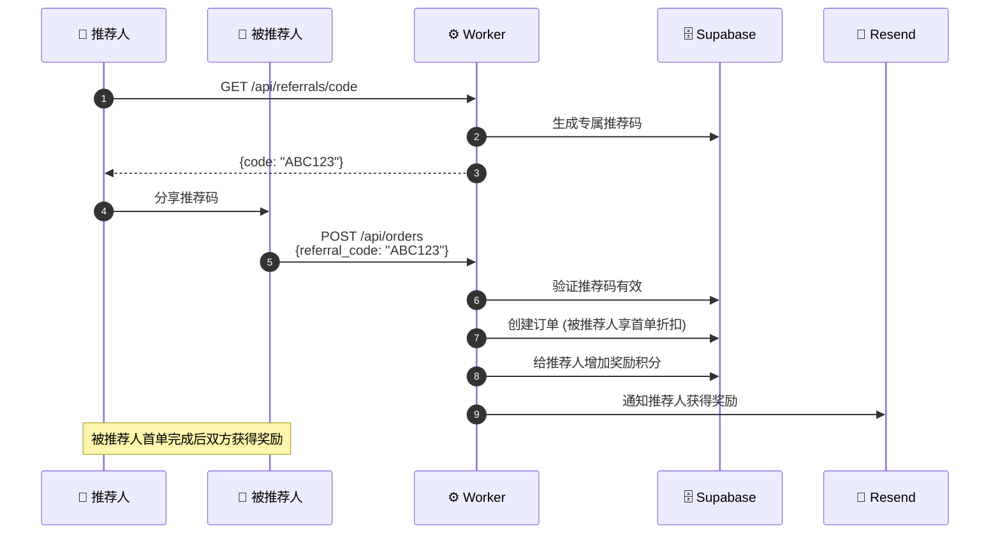
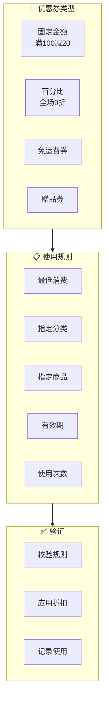

# 会员积分系统流程图

## 11.1 用户留存模块总览

```mermaid
flowchart TB
    subgraph Retention["🎯 用户留存"]
        points["points.ts<br/>积分系统"]
        membership["membership.ts<br/>会员等级"]
        referrals["referrals.ts<br/>推荐有礼"]
        coupons["admin-coupons.ts<br/>优惠券"]
    end
    
    subgraph Benefits["🎁 权益"]
        Discount["折扣"]
        Bonus["积分加成"]
        Free["免运费"]
        Exclusive["专属商品"]
    end
    
    points --> Benefits
    membership --> Benefits
    referrals --> Benefits
    coupons --> Benefits
```

## 11.2 积分获取流程

```mermaid
sequenceDiagram
    autonumber
    participant U as 👤 用户
    participant W as ⚙️ Worker
    participant DB as 🗄️ Supabase

    Note over U,DB: 购物获取积分
    U->>W: 完成订单支付
    W->>DB: 获取会员等级
    W->>W: 计算积分<br/>金额 × 等级倍率
    W->>DB: 增加积分余额
    W->>DB: 记录积分流水
    
    Note over U,DB: 其他获取方式
    U->>W: 完成评价/签到/分享
    W->>DB: 按规则增加积分
```

## 11.3 积分消费流程

```mermaid
sequenceDiagram
    autonumber
    participant U as 👤 用户
    participant F as 🖥️ 前端
    participant W as ⚙️ Worker
    participant DB as 🗄️ Supabase

    U->>F: 结算页选择积分抵扣
    F->>W: GET /api/points/balance
    W->>DB: 查询可用积分
    W-->>F: {balance: 1000}
    
    U->>F: 选择抵扣 500 积分
    F->>W: POST /api/orders<br/>{points_used: 500}
    
    W->>DB: 验证积分足够
    W->>W: 计算抵扣金额<br/>500积分 = $5
    W->>DB: 扣减积分余额
    W->>DB: 创建订单 (减免后金额)
    W-->>F: 订单创建成功
```

## 11.4 会员等级体系

```mermaid
flowchart LR
    subgraph Levels["🏆 会员等级"]
        L1["🥉 普通会员<br/>消费 $0+<br/>━━━━━━<br/>1x 积分"]
        L2["🥈 银卡会员<br/>消费 $200+<br/>━━━━━━<br/>1.2x 积分<br/>95折"]
        L3["🥇 金卡会员<br/>消费 $500+<br/>━━━━━━<br/>1.5x 积分<br/>9折<br/>免运费"]
        L4["💎 钻石会员<br/>消费 $1000+<br/>━━━━━━<br/>2x 积分<br/>85折<br/>专属客服"]
    end
    
    L1 --> L2 --> L3 --> L4
```

## 11.5 推荐有礼流程

```mermaid
sequenceDiagram
    autonumber
    participant A as 👤 推荐人
    participant B as 👥 被推荐人
    participant W as ⚙️ Worker
    participant DB as 🗄️ Supabase
    participant E as 📧 Resend

    A->>W: GET /api/referrals/code
    W->>DB: 生成专属推荐码
    W-->>A: {code: "ABC123"}
    
    A->>B: 分享推荐码
    B->>W: POST /api/orders<br/>{referral_code: "ABC123"}
    
    W->>DB: 验证推荐码有效
    W->>DB: 创建订单 (被推荐人享首单折扣)
    W->>DB: 给推荐人增加奖励积分
    W->>E: 通知推荐人获得奖励
    
    Note over A,B: 被推荐人首单完成后双方获得奖励
```

## 11.6 优惠券系统

```mermaid
flowchart TB
    subgraph Types["🎫 优惠券类型"]
        Fixed["固定金额<br/>满100减20"]
        Percent["百分比<br/>全场9折"]
        Free["免运费券"]
        Gift["赠品券"]
    end
    
    subgraph Rules["📋 使用规则"]
        Min["最低消费"]
        Category["指定分类"]
        Product["指定商品"]
        Time["有效期"]
        Limit["使用次数"]
    end
    
    subgraph Validation["✅ 验证"]
        Check["校验规则"]
        Apply["应用折扣"]
        Record["记录使用"]
    end
    
    Types --> Rules --> Validation
```
