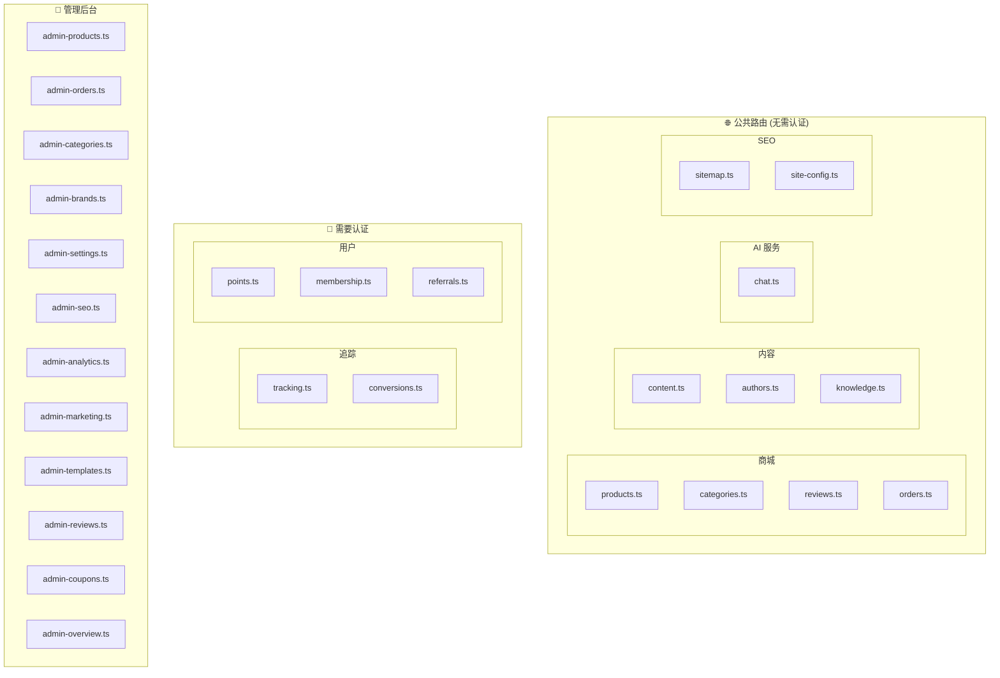
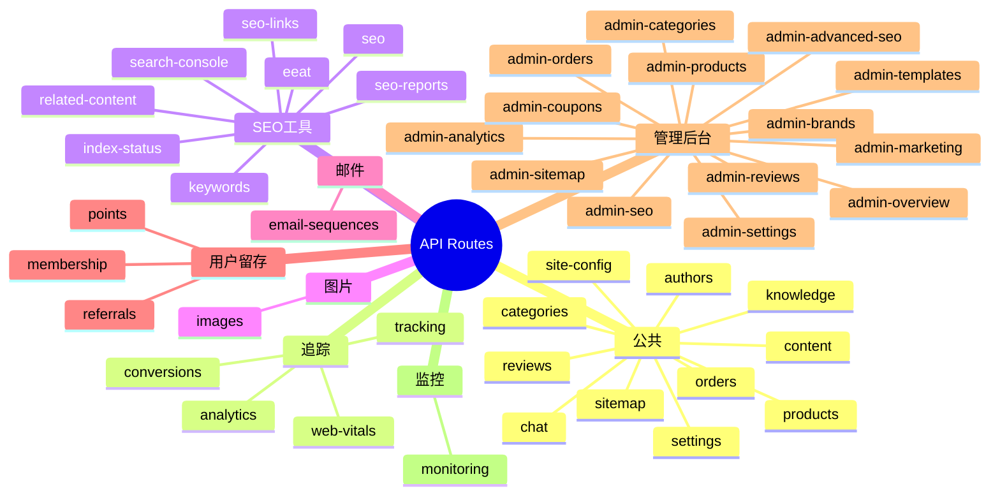

# API 路由总览

## 12.1 路由架构图

## 12.2 完整路由清单

## 12.3 路由文件详细说明

| 文件 | 路径前缀 | 用途 |
|------|----------|------|
| `products.ts` | `/api/products` | 产品查询/详情 |
| `categories.ts` | `/api/categories` | 分类列表/详情 |
| `orders.ts` | `/api/orders` | 创建订单/Stripe Webhook |
| `reviews.ts` | `/api/reviews` | 产品评论 |
| `chat.ts` | `/api/chat` | AI 客服对话 |
| `content.ts` | `/api/content` | 博客/内容管理 |
| `authors.ts` | `/api/authors` | 作者信息 |
| `knowledge.ts` | `/api/knowledge` | RAG 知识库 |
| `sitemap.ts` | `/sitemap.xml` | Sitemap 生成 |
| `site-config.ts` | `/api/site-config` | 品牌配置 |
| `settings.ts` | `/api/settings` | 网站设置 |
| `tracking.ts` | `/api/tracking` | UTM/弃购/Pixel |
| `conversions.ts` | `/api/conversions` | 服务端转化 |
| `analytics.ts` | `/api/analytics` | 数据分析 |
| `web-vitals.ts` | `/api/web-vitals` | Core Web Vitals |
| `seo.ts` | `/api/seo` | Meta 生成/内容分析 |
| `keywords.ts` | `/api/keywords` | 关键词研究 |
| `eeat.ts` | `/api/eeat` | E-E-A-T 评分 |
| `seo-links.ts` | `/api/seo-links` | 内链分析 |
| `seo-reports.ts` | `/api/seo-reports` | SEO 报告 |
| `index-status.ts` | `/api/index-status` | 索引检查 |
| `related-content.ts` | `/api/related-content` | AI 相关推荐 |
| `search-console.ts` | `/api/search-console` | GSC 集成 |
| `images.ts` | `/api/images` | 图片压缩/WebP |
| `email-sequences.ts` | `/api/email` | 邮件序列 |
| `points.ts` | `/api/points` | 积分系统 |
| `membership.ts` | `/api/membership` | 会员等级 |
| `referrals.ts` | `/api/referrals` | 推荐有礼 |
| `monitoring.ts` | `/api/monitoring` | 健康检查/监控 |

## 12.4 Admin 路由清单

| 文件 | 路径前缀 | 用途 |
|------|----------|------|
| `admin-products.ts` | `/api/admin/products` | 产品 CRUD |
| `admin-orders.ts` | `/api/admin/orders` | 订单管理 |
| `admin-categories.ts` | `/api/admin/categories` | 分类管理 |
| `admin-brands.ts` | `/api/admin/brands` | 品牌管理 |
| `admin-settings.ts` | `/api/admin/settings` | 设置管理 |
| `admin-seo.ts` | `/api/admin/seo` | SEO 管理 |
| `admin-advanced-seo.ts` | `/api/admin/advanced-seo` | 高级 SEO |
| `admin-sitemap.ts` | `/api/admin/sitemap` | Sitemap 管理 |
| `admin-analytics.ts` | `/api/admin/analytics` | 数据看板 |
| `admin-marketing.ts` | `/api/admin/marketing` | 营销配置 |
| `admin-templates.ts` | `/api/admin/templates` | 模板管理 |
| `admin-reviews.ts` | `/api/admin/reviews` | 评论审核 |
| `admin-coupons.ts` | `/api/admin/coupons` | 优惠券管理 |
| `admin-overview.ts` | `/api/admin/overview` | 仪表板概览 |
