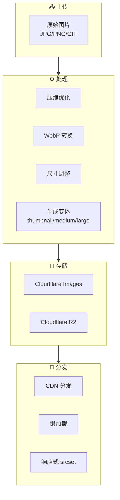
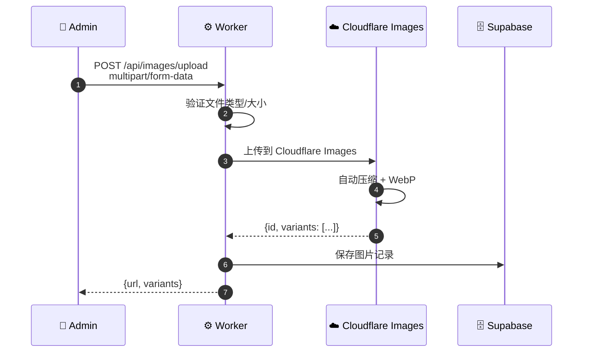
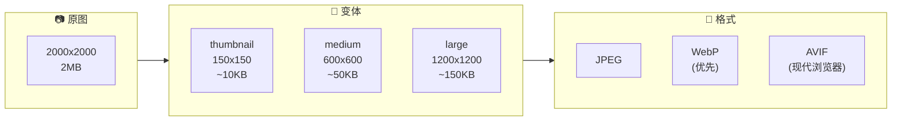

# 图片处理流程图

## 13.1 图片处理模块



## 13.2 图片上传流程



## 13.3 图片变体生成



## 13.4 响应式图片使用

```html
<picture>
  <source 
    type="image/avif" 
    srcset="product-150.avif 150w,
            product-600.avif 600w,
            product-1200.avif 1200w">
  <source 
    type="image/webp" 
    srcset="product-150.webp 150w,
            product-600.webp 600w,
            product-1200.webp 1200w">
  
</picture>
```
