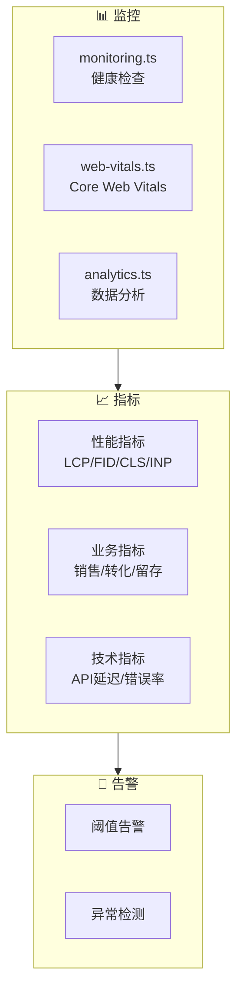
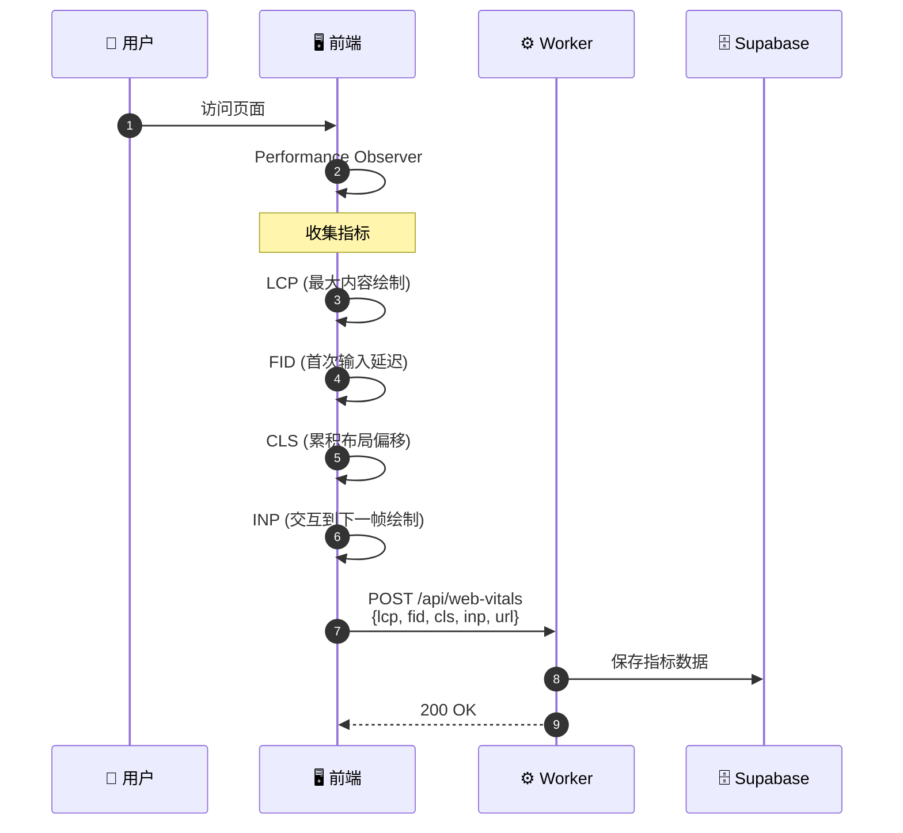
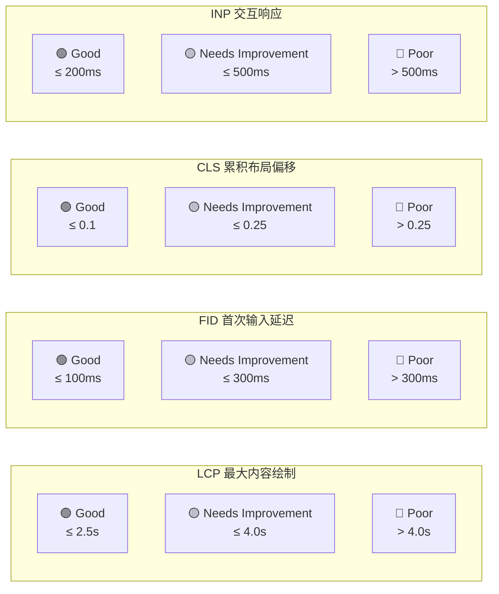
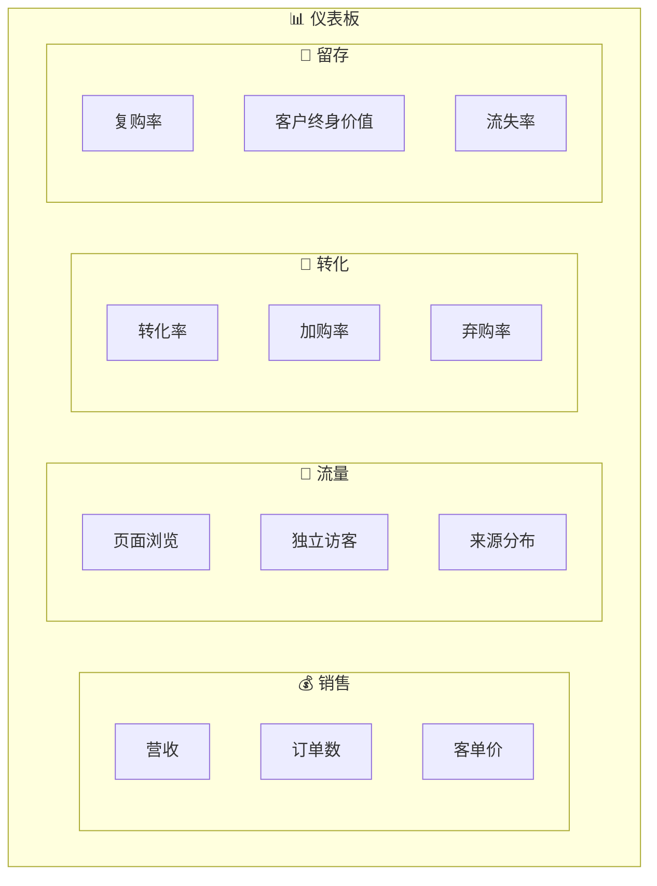
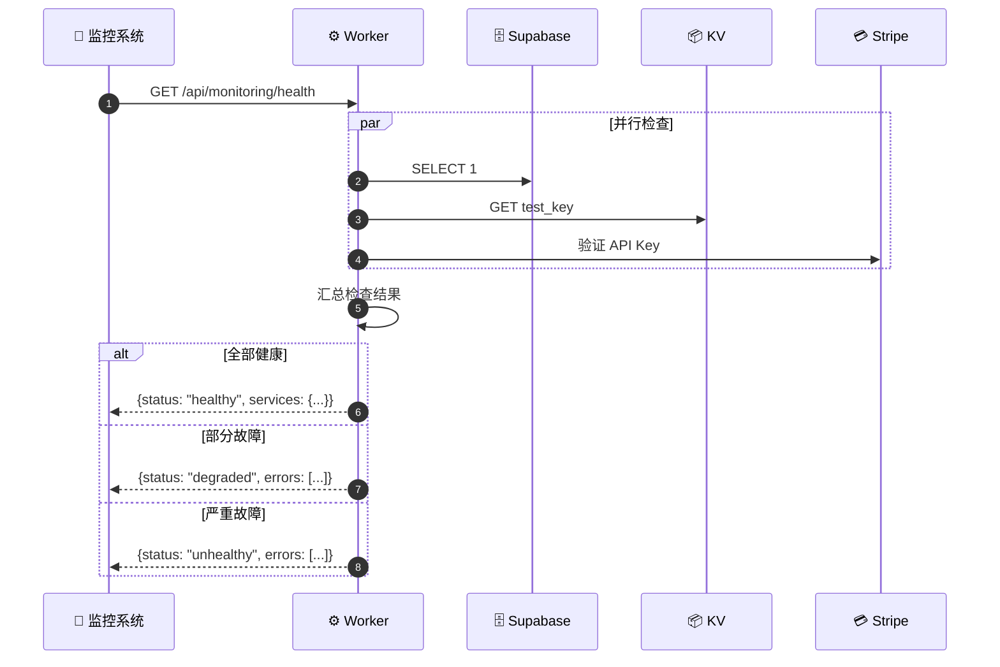
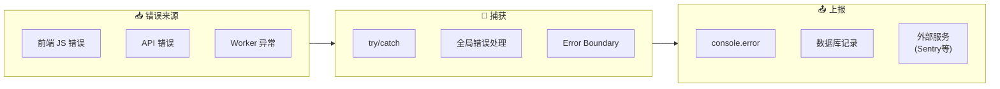

# 监控与分析流程图

## 14.1 监控模块总览

```mermaid
flowchart TB
    subgraph Monitoring["📊 监控"]
        health["monitoring.ts<br/>健康检查"]
        webVitals["web-vitals.ts<br/>Core Web Vitals"]
        analytics["analytics.ts<br/>数据分析"]
    end
    
    subgraph Metrics["📈 指标"]
        Performance["性能指标<br/>LCP/FID/CLS/INP"]
        Business["业务指标<br/>销售/转化/留存"]
        Technical["技术指标<br/>API延迟/错误率"]
    end
    
    subgraph Alerts["🚨 告警"]
        Threshold["阈值告警"]
        Anomaly["异常检测"]
    end
    
    Monitoring --> Metrics --> Alerts
```

## 14.2 Core Web Vitals 监控

```mermaid
sequenceDiagram
    autonumber
    participant U as 👤 用户
    participant F as 🖥️ 前端
    participant W as ⚙️ Worker
    participant DB as 🗄️ Supabase

    U->>F: 访问页面
    F->>F: Performance Observer
    
    Note over F: 收集指标
    F->>F: LCP (最大内容绘制)
    F->>F: FID (首次输入延迟)
    F->>F: CLS (累积布局偏移)
    F->>F: INP (交互到下一帧绘制)
    
    F->>W: POST /api/web-vitals<br/>{lcp, fid, cls, inp, url}
    W->>DB: 保存指标数据
    W-->>F: 200 OK
```

## 14.3 Web Vitals 指标阈值

```mermaid
flowchart LR
    subgraph LCP["LCP 最大内容绘制"]
        LCP_G["🟢 Good<br/>≤ 2.5s"]
        LCP_N["🟡 Needs Improvement<br/>≤ 4.0s"]
        LCP_P["🔴 Poor<br/>> 4.0s"]
    end
    
    subgraph FID["FID 首次输入延迟"]
        FID_G["🟢 Good<br/>≤ 100ms"]
        FID_N["🟡 Needs Improvement<br/>≤ 300ms"]
        FID_P["🔴 Poor<br/>> 300ms"]
    end
    
    subgraph CLS["CLS 累积布局偏移"]
        CLS_G["🟢 Good<br/>≤ 0.1"]
        CLS_N["🟡 Needs Improvement<br/>≤ 0.25"]
        CLS_P["🔴 Poor<br/>> 0.25"]
    end
    
    subgraph INP["INP 交互响应"]
        INP_G["🟢 Good<br/>≤ 200ms"]
        INP_N["🟡 Needs Improvement<br/>≤ 500ms"]
        INP_P["🔴 Poor<br/>> 500ms"]
    end
```

## 14.4 业务分析仪表板

```mermaid
flowchart TB
    subgraph Dashboard["📊 仪表板"]
        subgraph Sales["💰 销售"]
            Revenue["营收"]
            Orders["订单数"]
            AOV["客单价"]
        end
        
        subgraph Traffic["👥 流量"]
            PV["页面浏览"]
            UV["独立访客"]
            Sources["来源分布"]
        end
        
        subgraph Conversion["🎯 转化"]
            CVR["转化率"]
            CartRate["加购率"]
            Abandon["弃购率"]
        end
        
        subgraph Retention["🔄 留存"]
            Repeat["复购率"]
            LTV["客户终身价值"]
            Churn["流失率"]
        end
    end
```

## 14.5 健康检查端点

```mermaid
sequenceDiagram
    autonumber
    participant M as 🤖 监控系统
    participant W as ⚙️ Worker
    participant DB as 🗄️ Supabase
    participant KV as 📦 KV
    participant S as 💳 Stripe

    M->>W: GET /api/monitoring/health
    
    par 并行检查
        W->>DB: SELECT 1
        W->>KV: GET test_key
        W->>S: 验证 API Key
    end
    
    W->>W: 汇总检查结果
    
    alt 全部健康
        W-->>M: {status: "healthy", services: {...}}
    else 部分故障
        W-->>M: {status: "degraded", errors: [...]}
    else 严重故障
        W-->>M: {status: "unhealthy", errors: [...]}
    end
```

## 14.6 错误追踪流程

```mermaid
flowchart LR
    subgraph Sources["📥 错误来源"]
        FE["前端 JS 错误"]
        API["API 错误"]
        Worker["Worker 异常"]
    end
    
    subgraph Capture["📝 捕获"]
        Try["try/catch"]
        Global["全局错误处理"]
        Boundary["Error Boundary"]
    end
    
    subgraph Report["📤 上报"]
        Log["console.error"]
        DB["数据库记录"]
        External["外部服务<br/>(Sentry等)"]
    end
    
    Sources --> Capture --> Report
```
